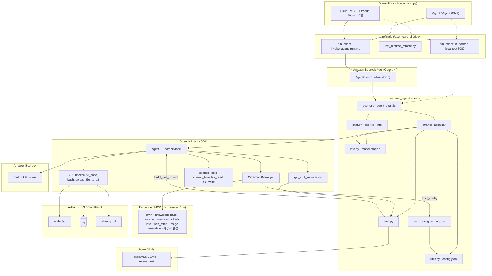
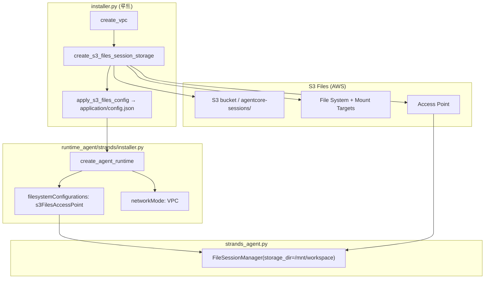

# Strands Agent의 AgentCore 배포 및 활용

여기에서는 Streamlit app은 Amazon ECS에 배포하고, Agent는 AgentCore Runtime을 활용해 배포합니다.


## 주요 구현 

### 전체 Architecture

전체적인 Architecture는 아래와 같습니다. 여기서는 MCP/SKILL를 지원하는 Strands agent를 [AgentCore](https://docs.aws.amazon.com/bedrock-agentcore/latest/devguide/what-is-bedrock-agentcore.html)를 이용해 배포하고 streamlit 애플리케이션을 이용해 사용합니다. 개발자는 각 agent에 맞는 [Dockerfile](./runtime/strands/Dockerfile)을 이용하여, docker image를 생성하고 ECR에 업로드 합니다. 이후 [bedrock-agentcore-control](https://docs.aws.amazon.com/bedrock-agentcore-control/latest/APIReference/Welcome.html)의 [installer.py](./runtime/strands/installer.py)을 이용해서 [AgentCore](https://docs.aws.amazon.com/bedrock-agentcore/latest/devguide/what-is-bedrock-agentcore.html)의 runtime으로 배포합니다. 이 작업이 끝나면 EC2와 같은 compute에 있는 streamlit에서 Strands와 Strands agent를 활용할 수 있습니다. 애플리케이션에서 AgentCore의 runtime을 호출할 때에는 [bedrock-agentcore](https://boto3.amazonaws.com/v1/documentation/api/latest/reference/services/bedrock-agentcore.html)의 [invoke_agent_runtime](https://boto3.amazonaws.com/v1/documentation/api/latest/reference/services/bedrock-agentcore/client/invoke_agent_runtime.html)을 이용합니다. 이때에 각 agent를 생성할 때에 확인할 수 있는 [agentRuntimeArn](https://docs.aws.amazon.com/bedrock-agentcore-control/latest/APIReference/API_Agent.html)을 이용합니다. Agent는 [MCP](https://modelcontextprotocol.io/introduction)을 이용해 RAG, AWS Document, Tavily와 같은 검색 서비스를 활용할 수 있습니다. 여기에서는 RAG를 위하여 Lambda를 이용합니다. 데이터 저장소의 관리는 Knowledge base를 사용하고, 벡터 스토어로는 OpenSearch를 이용합니다. Agent에 필요한 S3, CloudFront, OpenSearch, Lambda등의 배포를 위해서는 AWS CDK를 이용합니다.


AgentCore의 runtime은 배포를 위해 Docker를 이용합니다. 현재(2025.7) 기준으로 arm64와 1GB 이하의 docker image를 지원합니다.

### Operation Architecture

Streamlit UI(`application/app.py`)에서 대화 모드·Skills·MCP·Strands Tools·모델을 선택하면 `application/agentcore_client.py`가 AgentCore Runtime(`invoke_agent_runtime`)으로 SSE 요청을 보냅니다. 로컬 개발 시에는 `run_agent_in_docker`로 `localhost:8080`의 Docker 컨테이너를 호출할 수 있습니다. Runtime은 `runtime_agent/strands/agent.py`의 `agent_strands` 엔트리포인트에서 Strands Agent, Agent Skills, 임베디드 MCP 서버를 연결한 뒤 Amazon Bedrock으로 추론합니다.



| 모드 | 모듈 | 설명 |
|------|------|------|
| **Agent** | `application/app.py` → `agentcore_client.run_agent` | 단일 턴 Agent. `history_mode=Disable`로 매 요청을 독립 처리 |
| **Agent (Chat)** | `application/app.py` → `agentcore_client.run_agent` | 대화 이력 유지. `history_mode=Enable`로 세션 기반 interactive 대화 |
| Strands Runtime | `runtime_agent/strands/agent.py` | Strands SDK `Agent` + `MCPClientManager` + strands_tools |
| 임베디드 MCP | `runtime_agent/strands/mcp_server_*.py` | Tavily/Knowledge Base/AWS Docs/Trade Info/Web Fetch/Image 생성/사용자 설정 MCP 제공 |
| Skill/MCP 선택 목록 | `application/skills.list`, `application/mcp.list` | UI에서 스킬·MCP 체크박스 옵션 제공 |

플랫폼은 **AgentCore**(서버리스 Runtime)와 **Docker**(로컬 `localhost:8080`)를 지원하며, 현재 애플리케이션은 `agent_type = "strands"` 고정으로 Strands Runtime을 사용합니다. MCP는 UI에서 `tavily`, `knowledge base`, `aws documentation`, `trade info`, `web_fetch`, `image generation`, `사용자 설정`을 체크박스로 선택합니다.

### 네트워크 설정

`strands-runtime`은 **ECS(Streamlit UI)** 와 **AgentCore Runtime(Strands 서버)** 가 모두 **private subnet** 에 배포됩니다. 이 환경에서는 인터넷으로 직접 나가지 않으므로, AWS API 호출은 **VPC Interface/Gateway Endpoint** 로, 외부 MCP·npm·cross-region 트래픽은 **NAT Gateway** 로 egress 를 열어야 합니다.

[installer.py](./installer.py) 가 신규 VPC 생성뿐 아니라 **기존 VPC 재사용 시**에도 아래 리소스를 자동으로 맞춥니다.

#### 구성 요약

```text
[사용자] → CloudFront → ALB (public subnet)
                              ↓
                    ECS App (private subnet)
                              ↓ bedrock-agentcore VPC Endpoint
                    AgentCore Runtime (private subnet, VPC mode)
                              ↓
              MCP: websearch (us-east-1 Gateway) / web_fetch (npm)
                              ↓ NAT Gateway (public subnet 경유)
                         Internet
```

| 구성 요소 | Subnet | 인터넷 egress |
|-----------|--------|----------------|
| ALB | Public | IGW |
| ECS Fargate | Private | VPC Endpoint + NAT |
| AgentCore Runtime | Private | VPC Endpoint + NAT |

#### VPC Interface Endpoint (us-west-2)

Private subnet 워크로드가 **같은 리전(us-west-2)** AWS API 에 도달할 때 사용합니다. `ensure_private_subnet_vpc_endpoints()` 가 생성·재사용합니다.

| AWS 서비스 | Endpoint 서비스 이름 | 용도 |
|------------|----------------------|------|
| Amazon ECR API | `com.amazonaws.us-west-2.ecr.api` | ECS/Runtime 이미지 pull 메타데이터 |
| Amazon ECR DKR | `com.amazonaws.us-west-2.ecr.dkr` | 컨테이너 이미지 레이어 pull |
| CloudWatch Logs | `com.amazonaws.us-west-2.logs` | ECS·Runtime 로그 전송 |
| Secrets Manager | `com.amazonaws.us-west-2.secretsmanager` | Runtime cold start 시 Tavily API 키 로드 ([runtime_agent/strands/utils.py](./runtime_agent/strands/utils.py)) |
| Bedrock AgentCore | `com.amazonaws.us-west-2.bedrock-agentcore` | ECS → `invoke_agent_runtime` |
| Bedrock AgentCore Control | `com.amazonaws.us-west-2.bedrock-agentcore-control` | Runtime ARN 검증, gateway 조회 |
| Amazon Bedrock Runtime | `com.amazonaws.us-west-2.bedrock-runtime` | Strands 모델 호출 (별도 생성) |
| Amazon S3 | `com.amazonaws.us-west-2.s3` (Gateway) | ECR 레이어·아티팩트·스토리지 |

Endpoint 는 private subnet 에 배치되며, ECS security group 과 Agent Runtime security group 모두 ingress(443) 를 허용해야 합니다.

#### NAT Gateway 와 private route table

아래 트래픽은 **VPC Endpoint 만으로는 처리할 수 없습니다.** Public subnet 에 **NAT Gateway** 를 두고, private subnet 전용 route table 에 `0.0.0.0/0 → NAT` 를 연결합니다 (`ensure_private_subnet_nat_routing()`).

| 트래픽 | 이유 |
|--------|------|
| **Websearch MCP** | Gateway 가 **us-east-1** (`gateway.bedrock-agentcore.us-east-1.amazonaws.com`) 에 있음. us-west-2 VPC Endpoint 로는 **다른 리전 API·Gateway HTTPS** 에 도달 불가 |
| **Websearch gateway URL 조회** | [runtime_agent/strands/mcp_config.py](./runtime_agent/strands/mcp_config.py) 가 `bedrock-agentcore-control` **us-east-1** API 호출 (`list_gateways` / `get_gateway`) |
| **Web_fetch MCP** | `npx -y mcp-server-fetch-typescript` 가 **npm registry** (`registry.npmjs.org`) 접속 필요 |
| **외부 URL fetch** | web_fetch·일반 HTTP 도구가 public 인터넷 대상에 접근 |

Websearch gateway 는 installer 가 `AGENTCORE_GATEWAY_REGION = "us-east-1"` 에 생성합니다. Runtime 은 us-west-2 VPC 에 있으므로 gateway 제어·데이터 평면 모두 **NAT egress** 가 필요합니다.

`application/config.json` 에 `agentcore_websearch_gateway_url` 이 있어도, gateway 에 **HTTPS로 연결**할 때는 여전히 NAT 가 필요합니다.

#### Websearch / Web_fetch 동작 경로

**Websearch** ([runtime_agent/strands/mcp_config.py](./runtime_agent/strands/mcp_config.py) → `websearch`):

1. (선택) `bedrock-agentcore-control` us-east-1 에서 gateway URL 조회  
2. `https://gateway-websearch-*.gateway.bedrock-agentcore.us-east-1.amazonaws.com/mcp` 로 MCP streamable HTTP 연결 (SigV4)

**Web_fetch** (`mcp_config.py` → `web_fetch`):

1. `npx` 로 `mcp-server-fetch-typescript` 패키지 다운로드 (인터넷)  
2. 런타임 중 대상 URL HTTP fetch (인터넷)

채팅 UI 기본 MCP 가 `['websearch', 'web_fetch']` 이므로, **NAT 없이** 배포하면 MCP 초기화 단계에서 요청이 멈춘 것처럼 보일 수 있습니다. MCP 없이 동작 확인 시 payload 에 `mcp_servers: []` 를 사용할 수 있습니다.

#### installer 자동 설정

루트 [installer.py](./installer.py) 실행 시 네트워크 관련 단계:

1. **VPC** — public/private subnet, security group  
2. **NAT Gateway** — public subnet 에 생성, private subnet → `private-rt-{project}` 연결  
3. **VPC Endpoint** — 위 표의 Interface/Gateway Endpoint  
4. **Agent Runtime VPC** — Runtime 을 private subnet + 전용 SG 로 배포 (`networkMode: VPC`)  
5. **S3 Files** — 세션 스토리지(NFS)용 mount target  

기존 VPC 를 재사용해도 private subnet 이 이미 있으면 NAT·route table 연결을 **다시 검증·보완**합니다.

#### 증상별 점검

| 증상 | CloudWatch 로그 힌트 | 확인 사항 |
|------|----------------------|-----------|
| UI 는 열리나 채팅 무응답 | ECS: `agentcore_client` 이후 로그 없음 | `bedrock-agentcore`, `bedrock-agentcore-control` Endpoint |
| Runtime cold start 120초 초과 | Runtime: `utils.py` 까지만 반복 | `secretsmanager` Endpoint |
| MCP 로드 후 멈춤 | Runtime: `mcp_servers: ['websearch', 'web_fetch']` 이후 정지 | **NAT Gateway**, private route `0.0.0.0/0 → NAT` |
| Websearch 만 실패 | gateway us-east-1 관련 timeout | NAT + IAM(InvokeGateway) |

로그 그룹:

- ECS UI: `/ecs/app-for-strands-runtime`  
- Agent Runtime: `/aws/bedrock-agentcore/runtimes/runtime_strands-*-DEFAULT`

#### 비용 참고

- **VPC Interface Endpoint**: 시간당·데이터 처리 요금  
- **NAT Gateway**: 시간당 요금 + NAT 처리 데이터 요금 (websearch/web_fetch 사용 시 발생)

운영 환경에서 MCP 를 쓰지 않는다면 NAT 없이 VPC Endpoint 만으로도 기본 채팅(`mcp_servers: []`)은 가능합니다. Websearch·Web_fetch 를 쓰려면 NAT 구성을 권장합니다.

### AgentCore 소개

- AgentCore Runtime: AI agent와 tool을 배포하고 트래픽에 따라 자동으로 확장(Scaling)이 가능한 serverless runtime입니다. Strands, CrewAI, Strands Agents를 포함한 다양한 오픈소스 프레임워크을 지원합니다. 빠른 cold start, 세션 격리, 내장된 신원 확인(built-in identity), multimodal payload를 지원합니다. 이를 통해 안전하고 빠른 출시가 가능합니다.
- AgentCore Memory: Agent가 편리하게 short term, long term 메모리를 관리할 수 있습니다.
- AgentCore Code Interpreter: 분리된 sandbox 환경에서 안전하게 코드를 실행할 수 있습니다.
- AgentCore Broswer: 브라우저를 이용해 빠르고 안전하게 웹크롤링과 같은 작업을 수행할 수 있습니다.
- AgentCore Gateway: API, Lambda를 비롯한 서비스들을 쉽게 Tool로 활용할 수 있습니다.
- AgentCore Observability: 상용 환경에서 개발자가 agent의 동작을 trace, debug, monitor 할 수 있습니다.


## Agent 구현

AgentCore는 SSE 방식의 stream을 제공합니다. 

### Strands

[Strands - agent.py](./strands_stream/agent.py)와 같이 stream으로 처리합니다. 아래와 같이 AgentCore를 endpoint로 지정할 때에 agent_stream의 값을 yeild로 전달하면 streamlit 같은 client에서 동적으로 응답을 받을 수 있습니다.

```python
from bedrock_agentcore.runtime import BedrockAgentCoreApp
app = BedrockAgentCoreApp()

@app.entrypoint
async def agentcore_strands(payload):
    # initiate agent
    await initiate_agent(
        system_prompt=None, 
        strands_tools=strands_tools, 
        mcp_servers=mcp_servers, 
        historyMode='Disable'
    )

    # run agent
    with mcp_manager.get_active_clients(mcp_servers) as _:
        agent_stream = agent.stream_async(query)

        async for event in agent_stream:
            text = ""            
            if "data" in event:
                text = event["data"]
                stream = {'data': text}
            elif "result" in event:
                final = event["result"]                
                message = final.message
                if message:
                    content = message.get("content", [])
                    result = content[0].get("text", "")
                    stream = {'result': result}
            elif "current_tool_use" in event:
                current_tool_use = event["current_tool_use"]
                name = current_tool_use.get("name", "")
                input = current_tool_use.get("input", "")
                toolUseId = current_tool_use.get("toolUseId", "")
                text = f"name: {name}, input: {input}"
                stream = {'tool': name, 'input': input, 'toolUseId': toolUseId}            
            elif "message" in event:
                message = event["message"]
                if "content" in message:
                    content = message["content"]
                    if "toolResult" in content[0]:
                        toolResult = content[0]["toolResult"]
                        toolUseId = toolResult["toolUseId"]
                        toolContent = toolResult["content"]
                        toolResult = toolContent[0].get("text", "")
                        stream = {'toolResult': toolResult, 'toolUseId': toolUseId}

            yield (stream)
```

#### Client

AgentCore로 agent_runtime_arn을 이용해 request에 대한 응답을 얻습니다. 이때 content-type이 "text/event-stream"인 경우에 prefix인 "data:"를 제거한 후에 json parser를 이용해 얻어진 값을 목적에 맞게 활용합니다.

```python
agent_core_client = boto3.client('bedrock-agentcore', region_name=bedrock_region)
response = agent_core_client.invoke_agent_runtime(
    agentRuntimeArn=agent_runtime_arn,
    runtimeSessionId=runtime_session_id,
    payload=payload,
    qualifier="DEFAULT" # DEFAULT or LATEST
)

result = current = ""
processed_data = set()  # Prevent duplicate data

# stream response
if "text/event-stream" in response.get("contentType", ""):
    for line in response["response"].iter_lines(chunk_size=10):
        line = line.decode("utf-8")        
        if line.startswith('data: '):
            data = line[6:].strip()  # Remove "data:" prefix and whitespace
            if data:  # Only process non-empty data
                # Check for duplicate data
                if data in processed_data:
                    continue
                processed_data.add(data)
                
                data_json = json.loads(data)
                if 'data' in data_json:
                    text = data_json['data']
                    logger.info(f"[data] {text}")
                    current += text
                    containers['result'].markdown(current)
                elif 'result' in data_json:
                    result = data_json['result']
                elif 'tool' in data_json:
                    tool = data_json['tool']
                    input = data_json['input']
                    toolUseId = data_json['toolUseId']
                    if toolUseId not in tool_info_list: # new tool info
                        tool_info_list[toolUseId] = index                                        
                        add_notification(containers, f"Tool: {tool}, Input: {input}")
                    else: # overwrite tool info
                        containers['notification'][tool_info_list[toolUseId]].info(f"Tool: {tool}, Input: {input}")                    
                elif 'toolResult' in data_json:
                    toolResult = data_json['toolResult']
                    toolUseId = data_json['toolUseId']
                    if toolUseId not in tool_result_list:  # new tool result
                        tool_result_list[toolUseId] = index
                        add_notification(containers, f"Tool Result: {toolResult}")
                    else: # overwrite tool result
                        containers['notification'][tool_result_list[toolUseId]].info(f"Tool Result: {toolResult}")
```


## 프로젝트 구조

프로젝트는 **Streamlit UI(`application/`)** 와 **Strands Agent Runtime(`runtime_agent/strands/`)** 으로 나뉩니다. UI는 ECS에서 사용자 입력·MCP/Skill/Strands Tools·모델 선택·스트리밍 결과 표시만 담당하고, Agent 추론·MCP·Skill 실행은 AgentCore Runtime 컨테이너에서 수행합니다.

루트 [installer.py](./installer.py)는 ECS·VPC·Knowledge Base(S3 Vectors)·**S3 Files 세션 스토리지** 등 AWS 인프라를 배포하고, [runtime_agent/strands/installer.py](./runtime_agent/strands/installer.py)는 AgentCore Runtime·ECR·IAM을 배포합니다.

### `application/` — Streamlit UI (ECS)

루트 [Dockerfile](./Dockerfile)로 빌드되어 ECS에 배포됩니다. AgentCore Runtime을 `invoke_agent_runtime`으로 호출하며, Agent 로직은 포함하지 않습니다.

```text
application/
├── app.py                  # Streamlit 진입점. 모드·MCP·Skill·Strands Tools·모델 선택, 채팅 UI
├── agentcore_client.py     # AgentCore Runtime 호출 (invoke_agent_runtime, SSE 파싱)
├── chat.py                 # UI 세션·대화 상태 관리
├── utils.py                # config.json 로드, 공통 유틸
├── notification_queue.py   # 도구 호출·스트리밍 알림 큐
├── info.py                 # 앱 메타 정보
├── mcp.list                # UI MCP 체크박스 목록 (Runtime의 mcp.list와 대응)
├── skills.list             # UI Skill 체크박스 목록 (Runtime의 skills.list와 대응)
└── config.json             # region, projectName, agentRuntimeArn 등 (배포 시 생성)
```

| 파일 | 역할 |
|------|------|
| `app.py` | Agent / Agent (Chat) 모드, MCP·Skill·Strands Tools·모델 선택 후 `agentcore_client.run_agent` 호출 |
| `agentcore_client.py` | payload(prompt, mcp_servers, skill_list, strands_tools, history_mode)를 Runtime으로 전송하고 SSE 스트림 처리 |
| `mcp.list` · `skills.list` | UI에 노출할 MCP·Skill 이름 목록. 선택값은 Runtime payload로 전달됨 |

### `runtime_agent/strands/` — Strands Agent (AgentCore Runtime)

[runtime_agent/strands/Dockerfile](./runtime_agent/strands/Dockerfile)로 arm64 이미지를 빌드하고, [runtime_agent/strands/installer.py](./runtime_agent/strands/installer.py)로 AgentCore Runtime에 배포합니다.

```text
runtime_agent/strands/
├── agent.py                # BedrockAgentCoreApp 엔트리포인트 (agent_strands)
├── strands_agent.py        # Strands Agent, BedrockModel, MCP·Skill·도구 바인딩
├── chat.py                 # FileSessionManager 기반 대화 메모리
├── skill.py                # SkillManager, get_skill_instructions 도구
├── mcp_config.py           # 선택된 MCP → stdio subprocess command/args 매핑
├── mcp_server_*.py         # MCP 서버 (retrieve, trade_info, image_generation, korea_weather 등)
├── mcp_retrieve.py         # Knowledge Base RAG MCP
├── agentcore_sigv4_auth.py # AgentCore MCP 호출용 SigV4 인증
├── mcp.list                # 지원 MCP 목록
├── skills.list             # 지원 Skill 목록
├── utils.py                # config 로드, Tavily API key(Secrets Manager) 등
├── info.py                 # 모델 프로필·메타 정보
├── installer.py            # AgentCore Runtime·IAM·ECR 배포
├── uninstaller.py          # AgentCore Runtime 리소스 삭제
├── test_runtime_remote.py  # 원격 Runtime 호출 테스트
├── Dockerfile              # AgentCore Runtime 컨테이너 이미지
├── config.json             # Knowledge Base ID, region, projectName 등
└── skills/                 # Skill 정의 (아래 참조)
    ├── docx/
    ├── pptx/
    ├── xlsx/
    ├── pdf/
    ├── skill-creator/
    ├── kma-weather/
    ├── usa-weather/
    └── subway/
```

| 구분 | 모듈 | 설명 |
|------|------|------|
| **엔트리포인트** | `agent.py` | AgentCore 요청 수신 → `strands_agent` 실행 |
| **Agent** | `strands_agent.py` | Strands SDK `Agent`, BedrockModel, MCPClientManager, 내장 도구 |
| **MCP** | `mcp_config.py`, `mcp_server_*.py` | UI에서 선택된 MCP를 컨테이너 내 stdio subprocess로 기동 |
| **Skill** | `skill.py`, `skills/` | `SKILL.md` 기반 지침. `get_skill_instructions` 도구로 로드 |
| **설정·배포** | `utils.py`, `installer.py`, `config.json` | AWS 리소스 연동, Secrets Manager, Runtime 배포 |

### Skill 구조 (`runtime_agent/strands/skills/`)

각 Skill은 `SKILL.md` 파일이 핵심이며, 필요에 따라 `scripts/`, `references/`, `assets/` 등의 보조 폴더를 포함할 수 있습니다. UI의 `application/skills.list`에서 선택한 이름과 `runtime_agent/strands/skills/` 하위 디렉터리가 대응합니다. (예: `seoul-subway` → `subway/`)

```text
skills/
├── docx/
│   ├── SKILL.md          # YAML 프론트매터 + 상세 지침
│   └── scripts/          # 문서 처리 스크립트
├── pptx/
│   └── SKILL.md
├── xlsx/
│   └── SKILL.md
├── pdf/
│   └── SKILL.md
├── kma-weather/
│   ├── SKILL.md
│   └── scripts/
├── usa-weather/
│   └── scripts/
├── subway/
│   └── SKILL.md
└── skill-creator/
    └── SKILL.md
```


## Runtime Agent

### IAM 인증

Agent가 MCP server에 요청을 보낼때 IAM 인증을 수행합니다. [create_agent_runtime](https://boto3.amazonaws.com/v1/documentation/api/latest/reference/services/bedrock-agentcore-control/client/create_agent_runtime.html)에서 authorizerConfiguration을 포함하지 않은 경우에 IAM으로 인증하게 됩니다. Runtime 생성시 client는 bedrock-agentcore-control을 사용하고 MCP server에 대한 ECR 경로를 가지고 있어야 합니다. 상세한 코드는 [installer.py](https://github.com/kyopark2014/agent-runtime/blob/main/runtime_mcp/iam_auth/kb-retriever/installer.py)을 참조합니다.

```python
client = boto3.client('bedrock-agentcore-control', region_name=aws_region)

response = client.create_agent_runtime(
    agentRuntimeName=runtime_name,
    agentRuntimeArtifact={
        'containerConfiguration': {
            'containerUri': f"{account_id}.dkr.ecr.{aws_region}.amazonaws.com/{repository_name}:{image_tag}"
        }
    },
	filesystemConfigurations=[
		{
			"sessionStorage": {
				"mountPath": "/mnt/workspace"
			}
		}
	],
    networkConfiguration={"networkMode": "PUBLIC"}, 
    roleArn=agent_runtime_role,
    protocolConfiguration={"serverProtocol": "MCP"}
)

print(f"✓ Agent runtime created: {response['agentRuntimeArn']}")
```

Agent에서 MCP server로 요청을 보낼때에는 아래와 같이 IAM 인증을 수행하기 위하여 request에 X-Amz-Security-Token을 포함합니다. 이를 위해 httpx의 event hook을 이용해 아래와 같이 구현할 수 있습니다. 상세코드는 [agent.py](https://github.com/kyopark2014/agent-runtime/blob/main/runtime_agent/Strands/agent.py)을 참조합니다.

```python
def _patched_httpx_async_init(self, *args, **kwargs):
    async def sign_request(request: httpx.Request) -> None:
        url_str = str(request.url)
        if "bedrock-agentcore" not in url_str:
            return
        if ".gateway.bedrock-agentcore." in url_str:
            return
        if request.headers.get("Authorization"):
            return

        boto_session = boto3.Session()
        credentials = boto_session.get_credentials().get_frozen_credentials()

        parsed_url = urlparse(url_str)
        host = parsed_url.netloc
        timestamp = datetime.now(timezone.utc).strftime("%Y%m%dT%H%M%SZ")

        body = None
        if request.content:
            if isinstance(request.content, bytes):
                body = request.content
            else:
                try:
                    body = await request.aread()
                    if hasattr(request, "_content"):
                        request._content = body
                except Exception:
                    pass

        aws_headers = {
            "host": host,
            "x-amz-date": timestamp,
            "Content-Type": request.headers.get("Content-Type", "application/json"),
            "Accept": request.headers.get("Accept", "application/json, text/event-stream"),
        }
        if body:
            aws_headers["Content-Length"] = str(len(body))

        aws_request = AWSRequest(
            method=request.method,
            url=url_str,
            headers=aws_headers,
            data=body,
        )

        region = _sigv4_region_for_bedrock_agentcore_url(url_str)
        auth = BotocoreSigV4Auth(credentials, "bedrock-agentcore", region)
        auth.add_auth(aws_request)

        request.headers["X-Amz-Date"] = timestamp
        request.headers["Authorization"] = aws_request.headers["Authorization"]
        if credentials.token:
            request.headers["X-Amz-Security-Token"] = credentials.token

    if "event_hooks" not in kwargs:
        kwargs["event_hooks"] = {"request": [], "response": []}
    elif not isinstance(kwargs["event_hooks"], dict):
        kwargs["event_hooks"] = {"request": [], "response": []}
    if "request" not in kwargs["event_hooks"]:
        kwargs["event_hooks"]["request"] = []
    kwargs["event_hooks"]["request"].append(sign_request)

    _original_httpx_async_init(self, *args, **kwargs)
```

이후 아래와 같이 auth_type이 iam이면, httpx.AsyncClient을 업데이트 합니다.

```python
import httpx
from bedrock_agentcore.runtime import BedrockAgentCoreApp

app = BedrockAgentCoreApp()

@app.entrypoint
async def agent_strands(payload):
    """Invoke the Strands agent with a payload."""
    
    query = payload.get("prompt")
    mcp_servers = payload.get("mcp_servers", [])
    skill_list = payload.get("skill_list", [])
    strands_tools = payload.get("strands_tools", strands_agent.strands_tools or [])
    model_name = payload.get("model_name")
    user_id = payload.get("user_id")

    if auth_type == "iam":
        httpx.AsyncClient.__init__ = _patched_httpx_async_init

    strands_agent.mcp_manager.start_agent_clients(mcp_servers)

    with strands_agent.mcp_manager.get_active_clients(mcp_servers) as _:
        agent_stream = strands_agent.agent.stream_async(query)

        async for event in agent_stream:
            if "data" in event:
                text = event["data"]
                streamed_text += text
                logger.info(f"[data] {text}")
                yield {"data": text}

            elif "result" in event:
                final = event["result"]
                message = final.message
                if message:
                    content = message.get("content", [])
                    text = content[0].get("text", "") if content else ""
                    logger.info(f"[result] {text}")
                    final_output = {"messages": text, "image_url": image_urls}

        result_text = final_output.get("messages") or streamed_text

        final_output = {
            "messages": result_text if result_text else "답변을 찾지 못하였습니다.",
            "image_url": image_urls,
        }

    yield {"result": final_output}
```


#### Session Storage

AgentCore Runtime에서 context를 관리하려면 **Session Storage**를 사용합니다. 이 프로젝트는 배포 후에도 대화 이력·agent state를 유지하기 위해 **Amazon S3 Files**를 `/mnt/workspace`에 마운트하고, Strands **`FileSessionManager`**가 해당 경로에 세션을 저장합니다. (`s3_files_access_point_arn`이 없으면 managed `sessionStorage` + `PUBLIC` 모드로 fallback합니다.)

### Runtime 생성 시 filesystem 활용

[runtime_agent/strands/installer.py](./runtime_agent/strands/installer.py)의 `create_agent_runtime_func()` / `update_agent_runtime_func()`에서 runtime을 생성·갱신할 때 `/mnt/workspace`를 마운트합니다. (`/mnt/` 하위 경로 필수)

#### S3 Files를 이용하는 경우

- **기본 (S3 Files)**: `s3FilesAccessPoint` + `networkMode: VPC`
- **fallback**: `sessionStorage` + `networkMode: PUBLIC` (`s3_files_access_point_arn` 없을 때)

아래는 **S3 Files 모드(기본)** 의 전체 `create_agent_runtime` 호출 예시입니다. `config`에는 루트 [installer.py](./installer.py)가 `application/config.json`에 기록한 S3 Files·VPC 키가 들어 있습니다.

```python
import boto3

client = boto3.client("bedrock-agentcore-control", region_name=config["region"])

response = client.create_agent_runtime(
    agentRuntimeName=runtime_name,  # 예: strands_runtime_strands
    agentRuntimeArtifact={
        "containerConfiguration": {
            "containerUri": (
                f"{config['accountId']}.dkr.ecr.{config['region']}"
                f".amazonaws.com/{repository_name}:{image_tag}"
            )
        }
    },
    filesystemConfigurations=[
        {
            "s3FilesAccessPoint": {
                "accessPointArn": config["s3_files_access_point_arn"],
                "mountPath": "/mnt/workspace",
            }
        }
    ],
    networkConfiguration={
        "networkMode": "VPC",
        "networkModeConfig": {
            "subnets": config["agent_runtime_vpc_subnets"],
            "securityGroups": config["agent_runtime_security_groups"],
        },
    },
    roleArn=config["agent_runtime_role"],
    protocolConfiguration={"serverProtocol": "HTTP"},
)

print(response["agentRuntimeArn"])
```

#### Runtime의 Session Storage를 사용하는 경우

Runtime이 가지고 있는 managed session storage만 쓸 때의 형태는 아래와 같습니다. Session Storage는 추가 요청이 없을때에도 2주간 저장되고 세션당 1G까지 저장됩니다. 다만, Runtime 재배포로 version이 업데이트되면, 세션이 초기화되므로, 세션 정보가 애플리케이션의 목적에 중요하다면, S3 Files를 권장합니다.

```python
response = client.create_agent_runtime(
    agentRuntimeName=runtime_name,
    agentRuntimeArtifact={
        "containerConfiguration": {
            "containerUri": f"{account_id}.dkr.ecr.{aws_region}.amazonaws.com/{repository_name}:{image_tag}"
        }
    },
    filesystemConfigurations=[
        {
            "sessionStorage": {
                "mountPath": "/mnt/workspace",  # /mnt/ 하위 경로 필수
            }
        }
    ],
    networkConfiguration={"networkMode": "PUBLIC"},
    roleArn=agent_runtime_role,
    protocolConfiguration={"serverProtocol": "HTTP"},
)
```

`update_agent_runtime`에도 **동일한** `filesystemConfigurations`와 `networkConfiguration`을 포함해야 합니다. update 시 누락하면 cold start마다 세션 데이터가 사라질 수 있습니다.

#### Session Manager 활용

filesystemConfigurations에서 설정한 Session Storage는 runtime에서 아래처럼 Session Manager를 이용해 활용할 수 있습니다.

```python
from strands import Agent
from strands.session.file_session_manager import FileSessionManager
from bedrock_agentcore.runtime.context import BedrockAgentCoreContext

# Create a session manager with a unique session ID 
session_manager = FileSessionManager(
	session_id=BedrockAgentCoreContext.get_session_id(),
	storage_dir="/mnt/workspace"
)

# Create an agent with the session manager
agent = Agent(session_manager=session_manager)

agent("Hello!") # This conversation is persisted
```

### Conversation Manager와 File Session Manager의 차이

Strands Agent는 `conversation_manager`와 `session_manager`를 **독립적으로** 받을 수 있으며, **함께 사용하는 것이 정상적인 패턴**입니다. 두 매니저는 역할이 다릅니다.

| | `conversation_manager` | `session_manager` |
|---|---|---|
| **역할** | 모델에 보낼 **대화 컨텍스트 관리** | 대화·상태 **영속 저장** |
| **관심사** | 메모리, 토큰 한도, 컨텍스트 길이 | 프로세스 재시작 후에도 세션 유지 |
| **동작 시점** | 매 호출/턴에서 in-memory로 동작 | 메시지·상태 변경 시 파일에 저장 |
| **현재 구현** | `SlidingWindowConversationManager(window_size=50)` | `FileSessionManager(session_id=..., storage_dir="/mnt/workspace")` |

**`conversation_manager`** — "지금 모델에게 뭘 보여줄까?"

- 대화 히스토리 크기 제어 (슬라이딩 윈도우, 요약, truncation)
- 컨텍스트 윈도우 초과 시 `reduce_context()`로 복구
- 큰 tool result 잘라내기
- **런타임 중** in-memory에서 동작

**`session_manager`** — "다음에 다시 켜도 기억할까?"

- 메시지, agent state, `conversation_manager_state`를 **디스크에 저장**
- AgentCore Runtime의 session storage(`/mnt/workspace`)와 연동
- 재시작 후 세션 복원

둘을 같이 쓰면 역할이 다음과 같이 나뉩니다.

```
[전체 대화 히스토리]  ← session_manager가 디스크에 저장
        ↓
[슬라이딩 윈도우 50턴] ← conversation_manager가 모델에 전달할 부분만 선택
        ↓
      LLM 호출
```

[`strands_agent.py`](./runtime_agent/strands/strands_agent.py)에서는 두 매니저를 함께 사용합니다.

```python
from strands.agent.conversation_manager import SlidingWindowConversationManager
from strands.session.file_session_manager import FileSessionManager

conversation_manager = SlidingWindowConversationManager(
    window_size=50,
)

session_manager = FileSessionManager(
    session_id="test-session",
    storage_dir="/mnt/workspace"
)

agent = Agent(
    model=model,
    system_prompt=system_prompt,
    tools=tools,
    conversation_manager=conversation_manager,  # 컨텍스트 관리
    session_manager=session_manager,            # 영속 저장
)
```

SDK 내부에서도 함께 동작하도록 설계되어 있습니다.

- `conversation_manager.apply_management()` — 호출 후 컨텍스트 정리
- `conversation_manager.reduce_context()` 후 `session_manager.sync_agent()` — 압축 결과를 세션에 반영
- 세션 복원 시 `conversation_manager.restore_from_session()` — 이전 윈도우/요약 상태 복원

**주의사항**

- `session_id`는 사용자/요청별로 고유하게 설정해야 합니다. 고정값(`"test-session"`)을 쓰면 모든 사용자가 같은 세션을 공유합니다.
- `window_size=50`이면 디스크에는 전체 대화가 저장되지만, 모델에는 최근 50턴만 전달됩니다.
- `/mnt/workspace`는 AgentCore session storage 마운트가 있어야 `FileSessionManager`가 정상 동작합니다.
- Runtime **Version 업데이트 후에도** 세션을 유지하려면 아래 [S3 Files 활용](#s3-files-활용)을 참고하세요. 이 프로젝트는 기본적으로 S3 Files를 `/mnt/workspace`에 마운트합니다.


### S3 Files 활용

AgentCore의 **Managed session storage**(`sessionStorage`)는 Runtime **Version 업데이트 시 세션 데이터가 초기화**됩니다. 배포 후에도 대화 이력·agent state를 유지하려면, 이 프로젝트는 **Amazon S3 Files**를 bring-your-own 파일시스템으로 마운트해 `/mnt/workspace`에 영속 저장합니다.

| 항목 | Managed `sessionStorage` | S3 Files `s3FilesAccessPoint` (현재 기본) |
|------|--------------------------|-------------------------------------------|
| API 키 | `sessionStorage` | `s3FilesAccessPoint` |
| Network | `PUBLIC` | `VPC` (private subnet 필수) |
| Version 업데이트 후 | 데이터 삭제 | **유지** |
| 실제 저장소 | AgentCore managed | S3 bucket `agentcore-sessions/` prefix |
| Runtime Agent 코드 | `storage_dir="/mnt/workspace"` | 동일 (변경 없음) |

#### 왜 S3 Files인가

- Managed storage는 stop/resume 사이클에는 유용하지만, `update_agent_runtime`으로 새 Version이 생기면 `/mnt/workspace`가 비워집니다.
- S3 Files는 AWS 문서 기준 **Runtime Version 업데이트의 영향을 받지 않습니다**.
- `FileSessionManager`가 쓰는 마운트 경로(`/mnt/workspace`)를 그대로 유지할 수 있어 Runtime Agent 코드 변경이 최소화됩니다.

#### 전체 아키텍처



#### 배포 흐름 (`installer.py`)

루트 installer는 VPC 생성 직후 `[5.5/10] Creating S3 Files session storage` 단계에서 아래 리소스를 **멱등(idempotent)** 으로 생성합니다.

1. **S3 Files sync IAM role** — `_get_or_create_s3files_sync_role()`
   - 역할명: `role-s3files-sync-for-{project_name}`
   - Trust principal: `elasticfilesystem.amazonaws.com` (S3 Files는 EFS NFS 레이어 공유)
   - Inline policy: S3 bucket read/write + EventBridge sync (`DO-NOT-DELETE-S3-Files*`)

2. **S3 Files file system** — `_get_or_create_s3files_file_system()`
   - 기존 bucket ARN과 일치하는 file system이 있으면 재사용
   - 없으면 `s3files.create_file_system()` 호출
   - prefix: `agentcore-sessions/` (`S3_FILES_SESSION_PREFIX`)
   - status가 `available`이 될 때까지 폴링 (`_wait_for_s3files_status`)

3. **Security groups**
   - `agent-runtime-sg-for-{project_name}`: AgentCore microVM용
   - `s3files-mount-sg-for-{project_name}`: mount target용, **TCP 2049** ingress from runtime SG
   - runtime SG → mount SG로 **egress 2049** 허용

4. **Mount targets** — `_ensure_s3files_mount_targets()`
   - VPC **private subnet**마다 mount target 생성 (AZ 정렬)
   - 이미 존재하는 subnet은 건너뜀

5. **Access point** — `_get_or_create_s3files_access_point()`
   - POSIX `uid/gid: 0/0` (컨테이너 root 실행)
   - 기존 access point가 있으면 재사용

6. **File system policy** — `_ensure_s3files_file_system_policy()`
   - AgentCore Runtime 실행 역할(`AmazonBedrockAgentCoreRuntimeRoleFor{project_name}`)에 `s3files:ClientMount` / `ClientWrite` 허용
   - NFS 클라이언트 쓰기 거부(`Permission denied on /mnt/workspace`) 방지

7. **VPC endpoint 보강** — `_add_security_group_to_vpc_endpoint()`
   - Bedrock VPC endpoint에 agent runtime SG 추가 (VPC 모드 Runtime의 Bedrock 접근)

생성 결과는 `apply_s3_files_config()`로 `application/config.json`에 기록됩니다.

```json
{
  "s3_files_file_system_id": "fs-xxxxxxxx",
  "s3_files_access_point_arn": "arn:aws:s3files:us-west-2:...:file-system/fs-xxx/access-point/fsap-xxx",
  "agent_runtime_vpc_subnets": ["subnet-aaa", "subnet-bbb"],
  "agent_runtime_security_groups": ["sg-runtime-xxx"]
}
```

이후 `install_agent_runtime("strands")`가 `runtime_agent/strands/installer.py`를 subprocess로 실행합니다.

#### AgentCore Runtime 연결 (`runtime_agent/strands/installer.py`)

`application/config.json`의 S3 Files 키는 `_ensure_config_defaults()`에서 `runtime_agent/strands/config.json`으로 동기화됩니다.

**저장소 모드 분기** — `s3_files_access_point_arn` 유무로 결정합니다.

```python
# runtime_agent/strands/installer.py

def _uses_s3_files_session_storage(config: dict) -> bool:
    return bool(config.get("s3_files_access_point_arn"))

def session_storage_filesystem_configurations(config: dict):
    access_point_arn = config.get("s3_files_access_point_arn")
    if access_point_arn:
        return [{
            "s3FilesAccessPoint": {
                "accessPointArn": access_point_arn,
                "mountPath": "/mnt/workspace",
            }
        }]
    # fallback: managed session storage
    return [{"sessionStorage": {"mountPath": "/mnt/workspace"}}]

def agent_runtime_network_configuration(config: dict):
    if not _uses_s3_files_session_storage(config):
        return {"networkMode": "PUBLIC"}
    return {
        "networkMode": "VPC",
        "networkModeConfig": {
            "subnets": config["agent_runtime_vpc_subnets"],
            "securityGroups": config["agent_runtime_security_groups"],
        },
    }
```

`create_agent_runtime_func()` / `update_agent_runtime_func()`는 위 헬퍼의 결과를 [Session Storage](#session-storage) 절의 전체 `create_agent_runtime` / `update_agent_runtime` 호출에 전달합니다. 배포 로그에서 아래 메시지로 모드를 확인할 수 있습니다.

```text
Session storage: S3 Files access point at /mnt/workspace (VPC mode)
✓ s3FilesAccessPoint verified: mountPath=/mnt/workspace, arn=arn:aws:s3files:...
```

**Agent Runtime IAM** — `create_bedrock_agentcore_policy()`에 S3 Files mount 권한이 조건부로 추가됩니다. `s3files:GetAccessPoint`는 **access point ARN**을 Resource로 지정해야 `update_agent_runtime` 시 `ValidationException`이 발생하지 않습니다. `s3files:ListMountTargets`도 Runtime 생성·갱신 검증에 필요합니다.

```python
file_system_arn = f"arn:aws:s3files:{region}:{accountId}:file-system/{file_system_id}"

# Client mount/write (file system ARN + access point condition)
{
    "Sid": "S3FilesClientAccess",
    "Effect": "Allow",
    "Action": ["s3files:ClientMount", "s3files:ClientWrite"],
    "Resource": file_system_arn,
    "Condition": {
        "ArnEquals": {"s3files:AccessPointArn": "{access_point_arn}"}
    },
}
# GetAccessPoint (access point ARN)
{
    "Sid": "S3FilesGetAccessPoint",
    "Effect": "Allow",
    "Action": ["s3files:GetAccessPoint"],
    "Resource": "{access_point_arn}",
}
# ListMountTargets (file system ARN)
{
    "Sid": "S3FilesListMountTargets",
    "Effect": "Allow",
    "Action": ["s3files:ListMountTargets"],
    "Resource": file_system_arn,
}
```

**S3 Files file system policy** — 루트 `installer.py`의 `_ensure_s3files_file_system_policy()`가 file system에 resource-based policy를 설정합니다. 실행 역할 IAM만으로는 NFS 쓰기가 허용되지 않을 수 있습니다.

```python
{
    "Effect": "Allow",
    "Principal": {
        "AWS": "arn:aws:iam::{accountId}:role/AmazonBedrockAgentCoreRuntimeRoleFor{project_name}"
    },
    "Action": ["s3files:ClientMount", "s3files:ClientWrite"],
    "Condition": {
        "StringEquals": {"s3files:AccessPointArn": "{access_point_arn}"}
    },
}
```

#### Runtime Agent에서의 사용 (`strands_agent.py`)

마운트 경로가 `/mnt/workspace`로 동일하므로 **Runtime Agent 코드는 변경하지 않습니다**. `create_agent()`에서 `FileSessionManager`가 세션별 디렉터리를 S3 Files 위에 기록합니다.

```python
# runtime_agent/strands/strands_agent.py

session_manager = FileSessionManager(
    session_id=get_runtime_session_id(),  # BedrockAgentCoreContext.get_session_id()
    storage_dir="/mnt/workspace",
)

agent = Agent(
    model=model,
    tools=tools,
    plugins=[skills_plugin] if skills_plugin else [],
    conversation_manager=conversation_manager,
    session_manager=session_manager,
)
```

디스크 구조 예시 (`session_id`별 격리):

```text
/mnt/workspace/
  session_<runtimeSessionId>/
    ...  # Strands SDK가 저장하는 messages, agent state
```

S3 측에는 `s3://{bucket}/agentcore-sessions/` prefix 아래에 동기화됩니다.

#### Managed storage와의 비교 (요약)

| 시나리오 | Managed `sessionStorage` | S3 Files |
|----------|--------------------------|----------|
| stop/resume (같은 Version) | 유지 | 유지 |
| `update_agent_runtime` 후 | **초기화** | **유지** |
| 14일 미호출 | 초기화 | 고객 관리 (별도 정책) |
| VPC 필요 | 아니오 | **예** |
| 세션 격리 | runtimeSessionId별 | `FileSessionManager`의 `session_<id>/` 경로 |

#### 적용·재배포

**전체 배포 (신규·기존 공통)**

```bash
cd strands-runtime
python3 installer.py
```

**Runtime만 S3 Files 모드로 전환** (`application/config.json`에 S3 Files 키가 이미 있을 때)

```bash
python3 runtime_agent/strands/installer.py
```

기존 Runtime이 `PUBLIC` + `sessionStorage`로 만들어져 있다면, runtime installer 재실행 시 `update_agent_runtime`으로 S3 Files + VPC 모드로 업데이트됩니다.

#### 주의사항

- S3 Files는 **VPC 모드 전용**입니다. private subnet, mount target AZ 정렬, SG(2049)가 맞지 않으면 invoke 시 HTTP 424(Failed Dependency)가 발생할 수 있습니다.
- `s3_files_access_point_arn`이 config에 없으면 installer는 **Managed `sessionStorage` + PUBLIC** 으로 fallback합니다.
- S3 Files는 NFS 기반이므로 S3 API로 즉시 읽어야 하는 downstream에는 동기화 지연(~60초)을 고려해야 합니다. `FileSessionManager`만 사용하는 AgentCore 세션에는 일반적으로 문제 없습니다.
- access point POSIX UID/GID는 컨테이너 실행 사용자와 일치해야 합니다. 현재 구현은 `uid/gid: 0/0`(root)입니다.
- 세션 파일은 버킷 루트가 아니라 **`agentcore-sessions/`** prefix 아래에 동기화됩니다. 콘솔에서 prefix로 확인하세요.
- **트러블슈팅**
  - S3 bucket이 비어 있고 Runtime이 `PUBLIC` + `sessionStorage`이면 S3 Files 마운트가 적용되지 않은 것입니다. `python3 runtime_agent/strands/installer.py`로 Runtime을 재배포하세요.
  - `update_agent_runtime` 시 `Ensure the role has s3files:GetAccessPoint` → 실행 역할 IAM에서 `GetAccessPoint` Resource를 access point ARN으로 분리했는지 확인하세요.
  - `/mnt/workspace`에 `Permission denied` → `_ensure_s3files_file_system_policy()`가 적용됐는지, `s3files:ClientWrite`가 file system policy에 있는지 확인하세요.

## 배포하기

아래와 같이 EC2를 이용해 배포 환경을 구성합니다.

1. AWS Console의 EC2에 접속해서 [Launch instance]를 선택합니다.
2. EC2 생성시 Architecture로 Arm64을 선택하고 나머지는 기본값으로 생성합니다.
3. [EC2 Instance Connect]로 접속해서 아래와 같이 python, pip, git, boto3를 설치합니다.

```text
sudo yum install python3 python3-pip git 
pip install boto3 
```

4. 아래 명령어로 docker를 설치합니다.

```bash
sudo yum install -y docker
sudo systemctl start docker
sudo systemctl enable docker
sudo usermod -aG docker ec2-user
newgrp docker
docker info
```

5. Workshop의 경우에 아래 형태로 된 Credential을 복사하여 EC2 터미널에 입력합니다.


6. 아래와 같이 git source를 가져옵니다.

```python
git clone https://github.com/kyopark2014/strands-runtime
```

7. 아래와 같이 [installer.py](./installer.py)를 이용해 설치를 시작합니다.

```text
python3 strands-runtime/installer.py
```

8. 설치가 완료되면 CloudFront로 접속하여 동작을 확인합니다. Agent를 선택한 후에 적절한 MCP tool을 선택하여 원하는 작업을 수행합니다.

9. 인프라가 더이상 필요없을 때에는 루트 [uninstaller.py](./uninstaller.py)를 이용해 제거합니다. AgentCore Runtime, S3 Files, VPC, ECS, Knowledge Base와 함께 `application/config.json`도 정리됩니다.

```text
python uninstaller.py
```


### Knowledge Base 문서 동기화 하기 

Knowledge Base에서 문서를 활용하기 위해서는 S3에 문서 등록 및 동기화기 필요합니다. [S3 Console](https://us-west-2.console.aws.amazon.com/s3/home?region=us-west-2)에 접속하여 "storage-for-agentcore-xxxxxxxxxxxx-us-west-2"를 선택하고, 아래와 같이 docs폴더를 생성한 후에 파일을 업로드 합니다. 


이후 [Knowledge Bases Console](https://us-west-2.console.aws.amazon.com/bedrock/home?region=us-west-2#/knowledge-bases)에 접속하여, "agentcore"라는 Knowledge Base를 선택합니다. 이후 아래와 같이 [Sync]를 선택합니다.


### Local에서 실행하기

AWS 환경을 잘 활용하기 위해서는 [AWS CLI를 설치](https://docs.aws.amazon.com/ko_kr/cli/v1/userguide/cli-chap-install.html)하여야 합니다. EC2에서 배포하는 경우에는 별도로 설치가 필요하지 않습니다. Local에 설치시는 아래 명령어를 참조합니다.

```text
curl "https://awscli.amazonaws.com/awscli-exe-linux-x86_64.zip" -o "awscliv2.zip" 
unzip awscliv2.zip
sudo ./aws/install
```

AWS credential을 아래와 같이 AWS CLI를 이용해 등록합니다.

```text
aws configure
```

설치하다가 발생하는 각종 문제는 [Kiro-cli](https://aws.amazon.com/ko/blogs/korea/kiro-general-availability/)를 이용해 빠르게 수정합니다. 아래와 같이 설치할 수 있지만, Windows에서는 [Kiro 설치](https://kiro.dev/downloads/)에서 다운로드 설치합니다. 실행시는 셀에서 "kiro-cli"라고 입력합니다. 

```python
curl -fsSL https://cli.kiro.dev/install | bash
```

venv로 환경을 구성하면 편리하게 패키지를 관리합니다. 아래와 같이 환경을 설정합니다.

```text
python -m venv .venv
source .venv/bin/activate
```

이후 다운로드 받은 github 폴더로 이동한 후에 아래와 같이 필요한 패키지를 추가로 설치 합니다.

```text
pip install -r requirements.txt
```

이후 아래와 같은 명령어로 streamlit을 실행합니다. 

```text
streamlit run application/app.py
```


### 비동기 실행

에이전트가 즉시 응답하고 백그라운드에서 계속 처리할 수 있습니다. 클라이언트는 동기/비동기 구분 없이 동일한 API 사용가능하고, 세션을 재사용하여 컨텍스트 유지합니다.

```python
import threading
import time
from strands import Agent, tool
from bedrock_agentcore.runtime import BedrockAgentCoreApp

app = BedrockAgentCoreApp()

@tool
def start_background_task(duration: int = 5) -> str:
    """백그라운드에서 지정된 시간 동안 실행되는 태스크 시작"""

    # 비동기 태스크 등록
    task_id = app.add_async_task("background_processing", {"duration": duration})

    # 별도 스레드에서 백그라운드 작업 실행
    def background_work():
        time.sleep(duration)  # 실제 작업 수행
        app.complete_async_task(task_id)  

    threading.Thread(target=background_work, daemon=True).start()

    return f"백그라운드 태스크 시작됨 (ID: {task_id}), {duration}초 후 완료 예정"

agent = Agent(tools=[start_background_task])

@app.entrypoint
def main(payload):
    user_message = payload.get("prompt", "3초짜리 태스크를 시작해줘")
    return {"message": agent(user_message).message}

if __name__ == "__main__":
    app.run()
```


## 실행 결과

"https://github.com/kyopark2014/strands-runtime/blob/main/README.md 을 정리해줘."와 같이 입력하면 웹의 정보를 편리하게 활용할 수 있습니다.


이때의 결과는 아래와 같습니다.


"aws document로 agent evalutation 에 대해 조사해줘."로 하면 필요한 정보를 조회하여 정리합니다.


## Reference 

[Invoke streaming agents](https://docs.aws.amazon.com/bedrock-agentcore/latest/devguide/runtime-invoke-agent.html)

[Get started with the Amazon Bedrock AgentCore Runtime starter toolkit](https://docs.aws.amazon.com/bedrock-agentcore/latest/devguide/runtime-getting-started-toolkit.html)

[Amazon Bedrock AgentCore - Developer Guide](https://docs.aws.amazon.com/pdfs/bedrock-agentcore/latest/devguide/bedrock-agentcore-dg.pdf)

[BedrockAgentCoreControlPlaneFrontingLayer](https://boto3.amazonaws.com/v1/documentation/api/latest/reference/services/bedrock-agentcore-control.html)

[get_agent_runtime](https://boto3.amazonaws.com/v1/documentation/api/latest/reference/services/bedrock-agentcore-control/client/get_agent_runtime.html)

[Amazon Bedrock AgentCore Samples](https://github.com/awslabs/amazon-bedrock-agentcore-samples)

[Amazon Bedrock AgentCore](https://buttoned-gull-5fa.notion.site/Amazon-Bedrock-AgentCore-23708996fdd380c2a6e1ffaa2e08c000)

[Amazon Bedrock AgentCore RuntCode Interpreter](https://github.com/awslabs/amazon-bedrock-agentcore-samples/tree/main/01-tutorials/05-AgentCore-tools/01-Agent-Core-code-interpreter)

[Add observability to your Amazon Bedrock AgentCore resources](https://docs.aws.amazon.com/bedrock-agentcore/latest/devguide/observability-configure.html)

[Hosting Strands Agents with Amazon Bedrock models in Amazon Bedrock AgentCore Runtime](https://github.com/awslabs/amazon-bedrock-agentcore-samples/blob/main/01-tutorials%2F06-AgentCore-observability%2F01-Agentcore-runtime-hosted%2Fruntime_with_strands_and_bedrock_models.ipynb)

[Agentic AI 펀드 매니저](https://github.com/ksgsslee/investment_advisor_strands)

[AWS re:Invent 2025 - Architecting scalable and secure agentic AI with Bedrock AgentCore (AIM431)](https://www.youtube.com/watch?v=wqmeZOT6mmc)


[Deploy Production-Ready Agents in 22 Minutes with AgentCore Runtime](https://www.youtube.com/watch?v=Q-tYIAuv9WI)

[AgentCore Workshop](https://atomoh.gitbook.io/aiops)
