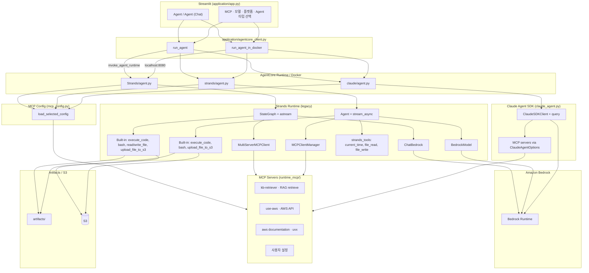

# Strands Agent의 AgentCore 배포 및 활용

여기에서는 AgentCore Runtime을 이용해서 Strands Agent을 배포하는 방법과 2) agent에 필요한 데이터를 수집하고 사용자의 의도에 따른 동작을 수행하는 방법을 설명합니다. AgentCore는 Agent와 MCP/SKILL를 위한 서버리스 production 환경으로서 Agent와 MCP 서버를 편리하게 배포하고 안전하고 효과적으로 운용할 수 있습니다.

## 주요 구현 

### 전체 Architecture

전체적인 Architecture는 아래와 같습니다. 여기서는 MCP/SKILL를 지원하는 Strands agent를 [AgentCore](https://docs.aws.amazon.com/bedrock-agentcore/latest/devguide/what-is-bedrock-agentcore.html)를 이용해 배포하고 streamlit 애플리케이션을 이용해 사용합니다. 개발자는 각 agent에 맞는 [Dockerfile](./runtime/Strands/Dockerfile)을 이용하여, docker image를 생성하고 ECR에 업로드 합니다. 이후 [bedrock-agentcore-control](https://docs.aws.amazon.com/bedrock-agentcore-control/latest/APIReference/Welcome.html)의 [create_agent_runtime.py](./runtime/Strands/create_agent_runtime.py)을 이용해서 [AgentCore](https://docs.aws.amazon.com/bedrock-agentcore/latest/devguide/what-is-bedrock-agentcore.html)의 runtime으로 배포합니다. 이 작업이 끝나면 EC2와 같은 compute에 있는 streamlit에서 Strands와 Strands agent를 활용할 수 있습니다. 애플리케이션에서 AgentCore의 runtime을 호출할 때에는 [bedrock-agentcore](https://boto3.amazonaws.com/v1/documentation/api/latest/reference/services/bedrock-agentcore.html)의 [invoke_agent_runtime](https://boto3.amazonaws.com/v1/documentation/api/latest/reference/services/bedrock-agentcore/client/invoke_agent_runtime.html)을 이용합니다. 이때에 각 agent를 생성할 때에 확인할 수 있는 [agentRuntimeArn](https://docs.aws.amazon.com/bedrock-agentcore-control/latest/APIReference/API_Agent.html)을 이용합니다. Agent는 [MCP](https://modelcontextprotocol.io/introduction)을 이용해 RAG, AWS Document, Tavily와 같은 검색 서비스를 활용할 수 있습니다. 여기에서는 RAG를 위하여 Lambda를 이용합니다. 데이터 저장소의 관리는 Knowledge base를 사용하고, 벡터 스토어로는 OpenSearch를 이용합니다. Agent에 필요한 S3, CloudFront, OpenSearch, Lambda등의 배포를 위해서는 AWS CDK를 이용합니다.


AgentCore의 runtime은 배포를 위해 Docker를 이용합니다. 현재(2025.7) 기준으로 arm64와 1GB 이하의 docker image를 지원합니다.

### Operation Architecture

Streamlit UI(`application/app.py`)에서 Agent 타입·MCP·모델·플랫폼을 선택하면 `agentcore_client.py`가 AgentCore Runtime(`invoke_agent_runtime`) 또는 로컬 Docker(`localhost:8080`)로 요청을 보냅니다. Runtime은 `runtime_agent/{Strands,strands,claude}/agent.py`의 `BedrockAgentCoreApp` 엔트리포인트에서 MCP와 내장 도구를 연결한 뒤 Amazon Bedrock으로 추론합니다. MCP 서버(`kb-retriever`, `use-aws`)는 `runtime_mcp/`에 별도 AgentCore Runtime으로 배포됩니다.



| 모드 | 모듈 | 설명 |
|------|------|------|
| **Agent** | `application/app.py` → `agentcore_client.run_agent` | 단일 턴 Agent. `history_mode=Disable`로 매 요청을 독립 처리 |
| **Agent (Chat)** | `application/app.py` → `agentcore_client.run_agent` | 대화 이력 유지. `history_mode=Enable`로 세션 기반 interactive 대화 |
| Strands Runtime | `runtime_agent/strands/agent.py` | Strands SDK `Agent` + `MCPClientManager` + strands_tools |
| MCP (RAG) | `runtime_mcp/iam_auth/kb-retriever/` | Bedrock Knowledge Base `retrieve` 도구를 AgentCore MCP Runtime으로 제공 |
| MCP (AWS) | `runtime_mcp/iam_auth/use-aws/` | AWS API 호출 도구를 AgentCore MCP Runtime으로 제공 |

플랫폼은 **AgentCore**(서버리스 Runtime)와 **Docker**(로컬 `localhost:8080`) 중 선택할 수 있으며, Agent 타입은 **Strands** / **strands** / **claude** 중 하나를 선택합니다. MCP는 UI에서 `kb-retriever`, `use-aws`, `aws document`, `사용자 설정`을 체크박스로 선택합니다.

### AgentCore 소개

- AgentCore Runtime: AI agent와 tool을 배포하고 트래픽에 따라 자동으로 확장(Scaling)이 가능한 serverless runtime입니다. Strands, CrewAI, Strands Agents를 포함한 다양한 오픈소스 프레임워크을 지원합니다. 빠른 cold start, 세션 격리, 내장된 신원 확인(built-in identity), multimodal payload를 지원합니다. 이를 통해 안전하고 빠른 출시가 가능합니다.
- AgentCore Memory: Agent가 편리하게 short term, long term 메모리를 관리할 수 있습니다.
- AgentCore Code Interpreter: 분리된 sandbox 환경에서 안전하게 코드를 실행할 수 있습니다.
- AgentCore Broswer: 브라우저를 이용해 빠르고 안전하게 웹크롤링과 같은 작업을 수행할 수 있습니다.
- AgentCore Gateway: API, Lambda를 비롯한 서비스들을 쉽게 Tool로 활용할 수 있습니다.
- AgentCore Observability: 상용 환경에서 개발자가 agent의 동작을 trace, debug, monitor 할 수 있습니다.

## Runtime Agent

## Runtime MCP

MCP 서버를 AgentCore runtime으로 배포하면 서비리스 기반으로 효율적으로 인프라를 관리하고 인증/보안과 같은 이슈도 쉽게 해결할 수 있습니다.

현재 runtime은 IAM과 JWT token 방식의 인증을 제공합니다.


### IAM 인증

Agent가 MCP server에 요청을 보낼때 IAM 인증을 수행합니다. [create_agent_runtime](https://boto3.amazonaws.com/v1/documentation/api/latest/reference/services/bedrock-agentcore-control/client/create_agent_runtime.html)에서 authorizerConfiguration을 포함하지 않은 경우에 IAM으로 인증하게 됩니다. Runtime 생성시 client는 bedrock-agentcore-control을 사용하고 MCP server에 대한 ECR 경로를 가지고 있어야 합니다. 상세한 코드는 [installer.py](https://github.com/kyopark2014/agent-runtime/blob/main/runtime_mcp/iam_auth/kb-retriever/installer.py)을 참조합니다.

```python
client = boto3.client('bedrock-agentcore-control', region_name=aws_region)

response = client.create_agent_runtime(
    agentRuntimeName=runtime_name,
    agentRuntimeArtifact={
        'containerConfiguration': {
            'containerUri': f"{account_id}.dkr.ecr.{aws_region}.amazonaws.com/{repository_name}:{image_tag}"
        }
    },
    networkConfiguration={"networkMode": "PUBLIC"}, 
    roleArn=agent_runtime_role,
    protocolConfiguration={"serverProtocol": "MCP"}
)

print(f"✓ Agent runtime created: {response['agentRuntimeArn']}")
```

Agent에서 MCP server로 요청을 보낼때에는 아래와 같이 IAM 인증을 수행하기 위하여 request에 X-Amz-Security-Token을 포함합니다. 이를 위해 httpx의 event hook을 이용해 아래와 같이 구현할 수 있습니다. 상세코드는 [agent.py](https://github.com/kyopark2014/agent-runtime/blob/main/runtime_agent/Strands/agent.py)을 참조합니다.

```python
original_init = httpx.AsyncClient.__init__
def patched_init(self, *args, **kwargs):
    # Add SigV4 signing event hook if needed
    async def sign_request(request: httpx.Request) -> None:
        """Sign the request with AWS SigV4 including the body"""
        # Only sign requests to bedrock-agentcore
        if "bedrock-agentcore" not in str(request.url):
            return
        
        # Get credentials
        boto_session = boto3.Session()
        credentials = boto_session.get_credentials().get_frozen_credentials()
        
        # Parse URL
        parsed_url = urlparse(str(request.url))
        host = parsed_url.netloc
        
        # Generate timestamp
        timestamp = datetime.now(timezone.utc).strftime('%Y%m%dT%H%M%SZ')
        
        # Read request body if available
        body = None
        if request.content:
            if isinstance(request.content, bytes):
                body = request.content
            else:
                try:
                    body = await request.aread()
                    if hasattr(request, '_content'):
                        request._content = body
                except Exception:
                    pass
        
        # Create AWS request headers
        aws_headers = {
            'host': host,
            'x-amz-date': timestamp,
            'Content-Type': request.headers.get('Content-Type', 'application/json'),
            'Accept': request.headers.get('Accept', 'application/json, text/event-stream')
        }
        
        if body:
            aws_headers['Content-Length'] = str(len(body))
        
        # Create AWS request for signing
        aws_request = AWSRequest(
            method=request.method,
            url=str(request.url),
            headers=aws_headers,
            data=body
        )
        
        # Sign the request
        region = utils.load_config().get("region", "us-west-2")
        auth = BotocoreSigV4Auth(credentials, "bedrock-agentcore", region)
        auth.add_auth(aws_request)
        
        # Update request headers
        request.headers['X-Amz-Date'] = timestamp
        request.headers['Authorization'] = aws_request.headers['Authorization']
        
        if credentials.token:
            request.headers['X-Amz-Security-Token'] = credentials.token
    
    # Add event_hooks to kwargs if not already present
    if 'event_hooks' not in kwargs:
        kwargs['event_hooks'] = {'request': [], 'response': []}
    elif not isinstance(kwargs['event_hooks'], dict):
        kwargs['event_hooks'] = {'request': [], 'response': []}
    
    if 'request' not in kwargs['event_hooks']:
        kwargs['event_hooks']['request'] = []
    
    # Add the sign_request hook
    kwargs['event_hooks']['request'].append(sign_request)

    # Call original init with modified kwargs
    original_init(self, *args, **kwargs)
```

그리고 이를 tool을 실행할때 사용합니다.  

```python
import httpx
from bedrock_agentcore.runtime import BedrockAgentCoreApp

app = BedrockAgentCoreApp()

@app.entrypoint
async def agent_Strands(payload):
    httpx.AsyncClient.__init__ = patched_init
    
    client = MultiServerMCPClient(server_params)
    tools = await client.get_tools()
    
    app = buildChatAgentWithHistory(tools)
    config = {
        "recursion_limit": 50,
        "configurable": {"thread_id": user_id},
        "tools": tools,
        "system_prompt": None
    }
    
    inputs = {"messages": [HumanMessage(content=query)]}
            
    value = final_output = None
    async for output in app.astream(inputs, config):
        for key, value in output.items():
            logger.info(f"--> key: {key}, value: {value}")

            if key == "messages" or key == "agent":
                if isinstance(value, dict) and "messages" in value:
                    final_output = value
                elif isinstance(value, list):
                    final_output = {"messages": value, "image_url": []}
                else:
                    final_output = {"messages": [value], "image_url": []}
```


#### Session Strogage

AgentCore Runtime에서 context를 관리하기 위해 Session Strage를 활용할 수 있습니다.

```python
client = boto3.client('bedrock-agentcore-control', region_name=aws_region)

response = client.create_agent_runtime(
    agentRuntimeName=runtime_name,
    agentRuntimeArtifact={
        'containerConfiguration': {
            'containerUri': f"{account_id}.dkr.ecr.{aws_region}.amazonaws.com/{repository_name}:{image_tag}"
        }
    },
    filesystemConfigurations=[
        {
            "sessionStorage": {
                "mountPath": "/mnt/workspace"  # /mnt/ 하위 경로 필수
            }
        }
    ]
    networkConfiguration={"networkMode": "PUBLIC"}, 
    roleArn=agent_runtime_role
)
```

filesystemConfigurations에서 설정한 Session Storage는 runtime에서 아래처럼 Session Manager를 이용해 활용할 수 있습니다.

```python
from strands import Agent
from strands.session.file_session_manager import FileSessionManager

# Create a session manager with a unique session ID 
session_manager = FileSessionManager(
	session_id="test-session”,
	storage_dir="/mnt/workspace"
)

# Create an agent with the session manager
agent = Agent(session_manager=session_manager)

agent("Hello!") # This conversation is persisted
```


### AgentCore Runtime으로 Agent 배포하기

Strands와 strands agent에 대한 이미지를 [Dockerfile](./runtime/Strands/Dockerfile)을 이용해 빌드후 ECR에 배포합니다. 


[create_agent_runtime.py](./runtime/Strands/create_agent_runtime.py)에서는 AgentCore에 처음으로 배포하는지 확인하여 아래와 같이 runtime을 생성합니다. 여기서 networkMode는 PUBLIC/VPC를 선택할 수 있어서 필요시 agent를 특정 VPC 접속으로 제한할 수 있고, Security Group을 이용하여 사내로 접속을 제한할 수 있습니다. 또한, protocolConfiguration은 HTTP, MCP, A2A를 선택하여 필요한 용도에 맞게 사용할 수 있습니다. 인증은 기본이 IAM이며, 필요시 authorizerConfiguration을 이용해 JWT를 사용할 수 있습니다.

```python
response = client.create_agent_runtime(
    agentRuntimeName=runtime_name,
    agentRuntimeArtifact={
        'containerConfiguration': {
            'containerUri': f"{accountId}.dkr.ecr.{aws_region}.amazonaws.com/{repositoryName}:{imageTags}"
        }
    },
    networkConfiguration={"networkMode":"PUBLIC"},
    protocolConfiguration={"serverProtocol":"HTTP"}
    roleArn=agent_runtime_role
)
agentRuntimeArn = response['agentRuntimeArn']
```

Runtime agent를 생성하기 전에 기존 runtime이 있는지는 아래와 같이 [list_agent_runtimes](https://boto3.amazonaws.com/v1/documentation/api/latest/reference/services/bedrock-agentcore-control/client/list_agent_runtimes.html)을 이용해 확인할 수 있습니다.

```python
client = boto3.client('bedrock-agentcore-control', region_name=aws_region)
response = client.list_agent_runtimes()

isExist = False
agentRuntimeId = None
agentRuntimes = response['agentRuntimes']
targetAgentRuntime = repositoryName
if len(agentRuntimes) > 0:
    for agentRuntime in agentRuntimes:
        agentRuntimeName = agentRuntime['agentRuntimeName']
        if agentRuntimeName == targetAgentRuntime:
            agentRuntimeId = agentRuntime['agentRuntimeId']
            isExist = True        
            break
```

이미 runtime이 있다면 아래와 같이 [update_agent_runtime](https://boto3.amazonaws.com/v1/documentation/api/latest/reference/services/bedrock-agentcore-control/client/update_agent_runtime.html)을 이용해 업데이트 합니다.

```python
response = client.update_agent_runtime(
    agentRuntimeId=agentRuntimeId,
    description="Update agent runtime",
    agentRuntimeArtifact={
        'containerConfiguration': {
            'containerUri': f"{accountId}.dkr.ecr.{aws_region}.amazonaws.com/{targetAgentRuntime}:{imageTags}"
        }
    },
    roleArn=agent_runtime_role,
    networkConfiguration={"networkMode":"PUBLIC"},
    protocolConfiguration={"serverProtocol":"HTTP"}
)
```


### Knowledge Base 문서 동기화 하기 

Knowledge Base에서 문서를 활용하기 위해서는 S3에 문서 등록 및 동기화기 필요합니다. [S3 Console](https://us-west-2.console.aws.amazon.com/s3/home?region=us-west-2)에 접속하여 "storage-for-agentcore-xxxxxxxxxxxx-us-west-2"를 선택하고, 아래와 같이 docs폴더를 생성한 후에 파일을 업로드 합니다. 


이후 [Knowledge Bases Console](https://us-west-2.console.aws.amazon.com/bedrock/home?region=us-west-2#/knowledge-bases)에 접속하여, "agentcore"라는 Knowledge Base를 선택합니다. 이후 아래와 같이 [Sync]를 선택합니다.


## Agent 구현

AgentCore는 SSE 방식의 stream을 제공합니다. 

### Strands

[Strands - agent.py](./strands_stream/agent.py)와 같이 stream으로 처리합니다. 아래와 같이 AgentCore를 endpoint로 지정할 때에 agent_stream의 값을 yeild로 전달하면 streamlit 같은 client에서 동적으로 응답을 받을 수 있습니다.

```python
from bedrock_agentcore.runtime import BedrockAgentCoreApp
app = BedrockAgentCoreApp()

@app.entrypoint
async def agentcore_strands(payload):
    # initiate agent
    await initiate_agent(
        system_prompt=None, 
        strands_tools=strands_tools, 
        mcp_servers=mcp_servers, 
        historyMode='Disable'
    )

    # run agent
    with mcp_manager.get_active_clients(mcp_servers) as _:
        agent_stream = agent.stream_async(query)

        async for event in agent_stream:
            text = ""            
            if "data" in event:
                text = event["data"]
                stream = {'data': text}
            elif "result" in event:
                final = event["result"]                
                message = final.message
                if message:
                    content = message.get("content", [])
                    result = content[0].get("text", "")
                    stream = {'result': result}
            elif "current_tool_use" in event:
                current_tool_use = event["current_tool_use"]
                name = current_tool_use.get("name", "")
                input = current_tool_use.get("input", "")
                toolUseId = current_tool_use.get("toolUseId", "")
                text = f"name: {name}, input: {input}"
                stream = {'tool': name, 'input': input, 'toolUseId': toolUseId}            
            elif "message" in event:
                message = event["message"]
                if "content" in message:
                    content = message["content"]
                    if "toolResult" in content[0]:
                        toolResult = content[0]["toolResult"]
                        toolUseId = toolResult["toolUseId"]
                        toolContent = toolResult["content"]
                        toolResult = toolContent[0].get("text", "")
                        stream = {'toolResult': toolResult, 'toolUseId': toolUseId}

            yield (stream)
```

#### Client

AgentCore로 agent_runtime_arn을 이용해 request에 대한 응답을 얻습니다. 이때 content-type이 "text/event-stream"인 경우에 prefix인 "data:"를 제거한 후에 json parser를 이용해 얻어진 값을 목적에 맞게 활용합니다.

```python
agent_core_client = boto3.client('bedrock-agentcore', region_name=bedrock_region)
response = agent_core_client.invoke_agent_runtime(
    agentRuntimeArn=agent_runtime_arn,
    runtimeSessionId=runtime_session_id,
    payload=payload,
    qualifier="DEFAULT" # DEFAULT or LATEST
)

result = current = ""
processed_data = set()  # Prevent duplicate data

# stream response
if "text/event-stream" in response.get("contentType", ""):
    for line in response["response"].iter_lines(chunk_size=10):
        line = line.decode("utf-8")        
        if line.startswith('data: '):
            data = line[6:].strip()  # Remove "data:" prefix and whitespace
            if data:  # Only process non-empty data
                # Check for duplicate data
                if data in processed_data:
                    continue
                processed_data.add(data)
                
                data_json = json.loads(data)
                if 'data' in data_json:
                    text = data_json['data']
                    logger.info(f"[data] {text}")
                    current += text
                    containers['result'].markdown(current)
                elif 'result' in data_json:
                    result = data_json['result']
                elif 'tool' in data_json:
                    tool = data_json['tool']
                    input = data_json['input']
                    toolUseId = data_json['toolUseId']
                    if toolUseId not in tool_info_list: # new tool info
                        tool_info_list[toolUseId] = index                                        
                        add_notification(containers, f"Tool: {tool}, Input: {input}")
                    else: # overwrite tool info
                        containers['notification'][tool_info_list[toolUseId]].info(f"Tool: {tool}, Input: {input}")                    
                elif 'toolResult' in data_json:
                    toolResult = data_json['toolResult']
                    toolUseId = data_json['toolUseId']
                    if toolUseId not in tool_result_list:  # new tool result
                        tool_result_list[toolUseId] = index
                        add_notification(containers, f"Tool Result: {toolResult}")
                    else: # overwrite tool result
                        containers['notification'][tool_result_list[toolUseId]].info(f"Tool Result: {toolResult}")
```


## 배포하기

### EC2로 배포하기

AWS console의 EC2로 접속하여 [Launch an instance](https://us-west-2.console.aws.amazon.com/ec2/home?region=us-west-2#Instances:)를 선택합니다. [Launch instance]를 선택한 후에 적당한 Name을 입력합니다. (예: es) key pair은 "Proceed without key pair"을 선택하고 넘어갑니다. 


Instance가 준비되면 [Connet] - [EC2 Instance Connect]를 선택하여 아래처럼 접속합니다. 


이후 아래와 같이 python, pip, git, boto3를 설치합니다.

```text
sudo yum install python3 python3-pip git docker -y
pip install boto3
```

Workshop의 경우에 아래 형태로 된 Credential을 복사하여 EC2 터미널에 입력합니다.


아래와 같이 git source를 가져옵니다.

```python
git clone https://github.com/kyopark2014/strands-runtime
```

아래와 같이 installer.py를 이용해 설치를 시작합니다.

```python
cd strands-runtime && python3 installer.py
```

API 구현에 필요한 credential은 secret으로 관리합니다. 따라서 설치시 필요한 credential 입력이 필요한데 아래와 같은 방식을 활용하여 미리 credential을 준비합니다. 

- 일반 인터넷 검색: [Tavily Search](https://app.tavily.com/sign-in)에 접속하여 가입 후 API Key를 발급합니다. 이것은 tvly-로 시작합니다.  

설치가 완료되면 CloudFront로 접속하여 동작을 확인합니다. 

접속한 후 아래와 같이 Agent를 선택한 후에 적절한 MCP/SKILL을 선택하여 원하는 작업을 수행합니다.


인프라가 더이상 필요없을 때에는 uninstaller.py를 이용해 제거합니다.

```text
python uninstaller.py
```


### Local에서 실행하기

AWS 환경을 잘 활용하기 위해서는 [AWS CLI를 설치](https://docs.aws.amazon.com/ko_kr/cli/v1/userguide/cli-chap-install.html)하여야 합니다. EC2에서 배포하는 경우에는 별도로 설치가 필요하지 않습니다. Local에 설치시는 아래 명령어를 참조합니다.

```text
curl "https://awscli.amazonaws.com/awscli-exe-linux-x86_64.zip" -o "awscliv2.zip" 
unzip awscliv2.zip
sudo ./aws/install
```

AWS credential을 아래와 같이 AWS CLI를 이용해 등록합니다.

```text
aws configure
```

설치하다가 발생하는 각종 문제는 [Kiro-cli](https://aws.amazon.com/ko/blogs/korea/kiro-general-availability/)를 이용해 빠르게 수정합니다. 아래와 같이 설치할 수 있지만, Windows에서는 [Kiro 설치](https://kiro.dev/downloads/)에서 다운로드 설치합니다. 실행시는 셀에서 "kiro-cli"라고 입력합니다. 

```python
curl -fsSL https://cli.kiro.dev/install | bash
```

venv로 환경을 구성하면 편리하게 패키지를 관리합니다. 아래와 같이 환경을 설정합니다.

```text
python -m venv .venv
source .venv/bin/activate
```

이후 다운로드 받은 github 폴더로 이동한 후에 아래와 같이 필요한 패키지를 추가로 설치 합니다.

```text
pip install -r requirements.txt
```

이후 아래와 같은 명령어로 streamlit을 실행합니다. 

```text
streamlit run application/app.py
```


### 비동기 실행

에이전트가 즉시 응답하고 백그라운드에서 계속 처리할 수 있습니다. 클라이언트는 동기/비동기 구분 없이 동일한 API 사용가능하고, 세션을 재사용하여 컨텍스트 유지합니다.

```python
import threading
import time
from strands import Agent, tool
from bedrock_agentcore.runtime import BedrockAgentCoreApp

app = BedrockAgentCoreApp()

@tool
def start_background_task(duration: int = 5) -> str:
    """백그라운드에서 지정된 시간 동안 실행되는 태스크 시작"""

    # 비동기 태스크 등록
    task_id = app.add_async_task("background_processing", {"duration": duration})

    # 별도 스레드에서 백그라운드 작업 실행
    def background_work():
        time.sleep(duration)  # 실제 작업 수행
        app.complete_async_task(task_id)  

    threading.Thread(target=background_work, daemon=True).start()

    return f"백그라운드 태스크 시작됨 (ID: {task_id}), {duration}초 후 완료 예정"

agent = Agent(tools=[start_background_task])

@app.entrypoint
def main(payload):
    user_message = payload.get("prompt", "3초짜리 태스크를 시작해줘")
    return {"message": agent(user_message).message}

if __name__ == "__main__":
    app.run()
```


## 실행 결과

"https://github.com/kyopark2014/strands-runtime/blob/main/README.md 을 정리해줘."와 같이 입력하면 웹의 정보를 편리하게 활용할 수 있습니다.


이때의 결과는 아래와 같습니다.


"aws document로 agent evalutation 에 대해 조사해줘."로 하면 필요한 정보를 조회하여 정리합니다.


## Reference 

[Invoke streaming agents](https://docs.aws.amazon.com/bedrock-agentcore/latest/devguide/runtime-invoke-agent.html)

[Get started with the Amazon Bedrock AgentCore Runtime starter toolkit](https://docs.aws.amazon.com/bedrock-agentcore/latest/devguide/runtime-getting-started-toolkit.html)

[Amazon Bedrock AgentCore - Developer Guide](https://docs.aws.amazon.com/pdfs/bedrock-agentcore/latest/devguide/bedrock-agentcore-dg.pdf)

[BedrockAgentCoreControlPlaneFrontingLayer](https://boto3.amazonaws.com/v1/documentation/api/latest/reference/services/bedrock-agentcore-control.html)

[get_agent_runtime](https://boto3.amazonaws.com/v1/documentation/api/latest/reference/services/bedrock-agentcore-control/client/get_agent_runtime.html)

[Amazon Bedrock AgentCore Samples](https://github.com/awslabs/amazon-bedrock-agentcore-samples)

[Amazon Bedrock AgentCore](https://buttoned-gull-5fa.notion.site/Amazon-Bedrock-AgentCore-23708996fdd380c2a6e1ffaa2e08c000)

[Amazon Bedrock AgentCore RuntCode Interpreter](https://github.com/awslabs/amazon-bedrock-agentcore-samples/tree/main/01-tutorials/05-AgentCore-tools/01-Agent-Core-code-interpreter)

[Add observability to your Amazon Bedrock AgentCore resources](https://docs.aws.amazon.com/bedrock-agentcore/latest/devguide/observability-configure.html)

[Hosting Strands Agents with Amazon Bedrock models in Amazon Bedrock AgentCore Runtime](https://github.com/awslabs/amazon-bedrock-agentcore-samples/blob/main/01-tutorials%2F06-AgentCore-observability%2F01-Agentcore-runtime-hosted%2Fruntime_with_strands_and_bedrock_models.ipynb)

[Agentic AI 펀드 매니저](https://github.com/ksgsslee/investment_advisor_strands)

[AWS re:Invent 2025 - Architecting scalable and secure agentic AI with Bedrock AgentCore (AIM431)](https://www.youtube.com/watch?v=wqmeZOT6mmc)


[Deploy Production-Ready Agents in 22 Minutes with AgentCore Runtime](https://www.youtube.com/watch?v=Q-tYIAuv9WI)

[AgentCore Workshop](https://atomoh.gitbook.io/aiops)

[Deploy Production-Ready Agents in 22 Minutes with AgentCore Runtime
