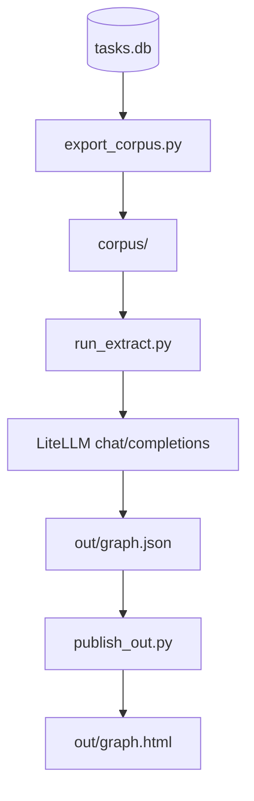

# strands-runtime / graph

Agent 채팅 DB(`tasks.db`)를 **Graphify 스타일 지식 그래프**로 만들고, 사용자별 관계 HTML(`out/graph_{user}.html`)로 봅니다.

**Cursor `/graphify` SKILL 없이** 이 폴더만으로 동작합니다. 시맨틱 추출은 **LiteLLM 게이트웨이**를 직접 호출합니다.

---

## Agent UI에서 Knowledge Graph 보기

사이드바 상단 브랜드 **Agentic work (user)** 를 클릭하면, 로그인한 사용자의 knowledge graph가 앱 내 팝업으로 열립니다.

```text
Sidebar "Agentic work (ksdyb)" 클릭
  → 앱 내 팝업(모달) + iframe → GET /api/graph
  → session …/graph/out/graph.html
```

| 항목 | 내용 |
|------|------|
| UI | `Sidebar.tsx` + `KnowledgeGraphModal.tsx` — 브랜드 클릭 시 인앱 팝업 |
| API | `GET /api/graph` — HTML 인라인 표시 (`Content-Disposition: inline`) |
| 상태 확인 | `GET /api/graph/status` → `{ user_id, exists, path }` |
| 파일 | `graph/out/graph_{slug}.html` (`safe_slug(user_id)`) |
| 인증 | 세션 쿠키 (`agent_user_id`). 다른 사용자 파일은 열리지 않음 |

### 사전 조건

1. 해당 사용자 그래프가 있어야 합니다.
   ```bash
   cd strands-runtime/graph
   python run_pipeline.py --user ksdyb
   # → out/graph.html
   ```
2. 앱 서버를 재시작한 뒤 UI에서 브랜드를 클릭합니다.
3. 파일이 없으면 404 HTML 안내 페이지가 표시됩니다 (`run_pipeline.py --user …` 안내 포함).

이메일 로그인 사용자(예: `foo@bar.com`)는 `out/graph_foo_bar_com.html`처럼 슬러그 파일명과 맞춰야 합니다.

---

## Graphify란

Graphify는 대화를 **배치(batch)** 로 읽어 엔티티·관계를 뽑고, 커뮤니티를 나눈 뒤 파일로 남기는 방식입니다.

| 항목 | 내용 |
|------|------|
| 엔진 | 시맨틱 = LiteLLM + 이 폴더 `lib/semantic.py` / 클러스터·export = **graphifyy** |
| 입력 | `tasks.db` → turn → 마크다운 **corpus** |
| 생성 | corpus **배치** (+ 파일 SHA256 캐시) |
| 저장 | `out/graph.json`, `out/graph.html` |
| 적합 | Neo4j 없이 일괄 분석·시각화·커뮤니티 탐색 |

관계는 Leiden/Louvain이 **계산**하지 않습니다. **LLM이 edge JSON으로 명시한 뒤**, 그 엣지 위에서 커뮤니티만 나눕니다.

### relation / confidence

| relation | 의미 |
|----------|------|
| `references` / `calls` / `implements` / `cites` | 명시적 참조·호출·구현·인용 |
| `conceptually_related_to` / `shares_data_with` | 개념·데이터 관련 |
| `semantically_similar_to` | 구조 링크 없이 같은 문제 (보통 INFERRED) |
| `rationale_for` | 설계 이유 → 대상 개념 |

| confidence | 의미 |
|------------|------|
| EXTRACTED | 원문에 드러남 (score 1.0) |
| INFERRED | 추론 (보통 0.6–0.9) |
| AMBIGUOUS | 불확실 (0.1–0.3) · HTML에서 점선 |

---

## 단독 파이프라인



| 단계 | 스크립트 | LLM? |
|------|----------|------|
| 1. DB → corpus | `export_corpus.py` | 없음 |
| 2. corpus → graph.json | `run_extract.py` | **LiteLLM** (기본 `claude-haiku-4-5`) |
| 3. 사용자별 HTML | `publish_out.py` | 없음 (클러스터 + rich UI) |

한 번에:

```bash
cd strands-runtime/graph
python -m pip install -r requirements.txt
# LiteLLM gateway: application/config.json (llm_gateway_url / llm_gateway_key)
# If unset: Bedrock Converse via AWS credentials (same as runtime_agent/langgraph)

python run_pipeline.py
# 또는 스모크:
python run_pipeline.py --user ksdyb --limit 5 --file-limit 5

open out/graph.html
```

단계별:

```bash
python export_corpus.py                 # 전체 사용자
python export_corpus.py --user ksdyb --limit 20
python run_extract.py                   # LiteLLM 시맨틱 추출
python run_extract.py --limit 5 --deep  # 파일 수 제한 / deep mode
python publish_out.py
```

---

## LLM 설정

1. **우선**: `application/config.json`의 `llm_gateway_url` / `llm_gateway_key`
2. **fallback**(옵션): `LLM_GATEWAY_URL` / `LLM_GATEWAY_KEY` 환경변수
3. **gateway 없음**: AWS Bedrock Converse (`runtime_agent/langgraph`와 동일)
   - 리전: `GRAPHIFY_BEDROCK_REGION` → `AWS_REGION` → `config.json` `region`
   - 모델: `GRAPHIFY_BEDROCK_MODEL` 또는 `GRAPHIFY_LLM_MODEL` 매핑
     (`claude-haiku-4-5` → `us.anthropic.claude-haiku-4-5-20251001-v1:0`)
   - 자격증명: boto3 기본 credential chain (IAM / `~/.aws`)

모델은 `graph/.env`의 `GRAPHIFY_LLM_MODEL`(기본 `claude-haiku-4-5`).
Gateway 사용 시 Claude / GPT / Gemini 등 LiteLLM id를 그대로 쓰면 됩니다.

관련 코드:

| 파일 | 역할 |
|------|------|
| `lib/config.py` | 경로 + gateway / Bedrock 설정 |
| `lib/llm.py` | LiteLLM `/v1` → JSON, 없으면 Bedrock Converse |
| `lib/semantic.py` | corpus chunk → 추출 프롬프트 (SKILL Part B 대체) |
| `lib/build_graph.py` | graphifyy `build_from_json` / `cluster` / `to_json` |

## 구성

```text
strands-runtime/graph/
├── README.md
├── requirements.txt
├── .env                   # TASKS_DB_PATH, GRAPHIFY_LLM_MODEL (no secrets)
├── export_corpus.py       # tasks.db → corpus/
├── run_extract.py         # corpus → out/graph.json (LLM)
├── publish_out.py         # graph.json → out/graph_{user}.html
├── run_pipeline.py        # 위 3단계 일괄
├── lib/
│   ├── config.py
│   ├── llm.py
│   ├── semantic.py
│   ├── build_graph.py
│   ├── tasks_db.py
│   ├── corpus.py
│   ├── out_graphs.py
│   └── rich_html.py       # agentcore 스타일 HTML
├── corpus/                # gitignore
└── out/                   # gitignore (graph.json, cache/, graph.html)
```

### HTML UI

`out/graph_{user}.html` — 헤더·통계·그룹 필터·검색·노드 상세(출처·관계)·엣지 라벨 (INFERRED 점선).

앱에서는 위 **Agent UI에서 Knowledge Graph 보기** 경로로 같은 파일을 엽니다.

---

## 주요 용어

| 용어 | 의미 |
|------|------|
| **turn** | user ↔ 바로 다음 assistant 한 쌍 |
| **corpus** | turn 마크다운 모음 |
| **시맨틱 추출** | LLM이 문서에서 노드·엣지 JSON을 뽑는 단계 |
| **graphifyy** | 클러스터·JSON/HTML export용 PyPI 패키지 |
| **Leiden/Louvain** | 커뮤니티 탐지 (새 관계 발명 없음) |
| **LiteLLM gateway** | OpenAI 호환 LLM 프록시 (`/v1/chat/completions`) |
