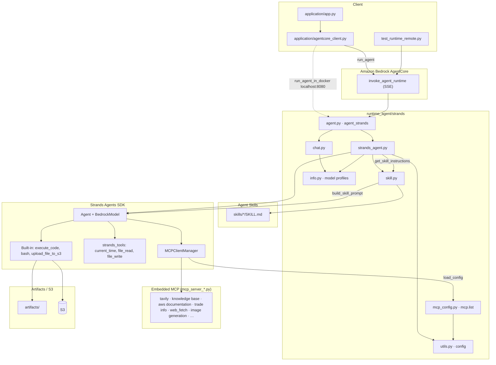

# Strands Agent Runtime (AgentCore)

[Strands agent](https://strandsagents.com/0.1.x/)와 [Agent Skills](https://platform.claude.com/docs/ko/agents-and-tools/agent-skills/overview)를 [Amazon Bedrock AgentCore](https://docs.aws.amazon.com/bedrock-agentcore/latest/devguide/what-is-bedrock-agentcore.html) Runtime으로 배포하는 구현입니다.

Strands Agent는 AI agent 구축 및 실행을 위해 설계된 오픈소스 SDK입니다. 계획(planning), 사고 연결(chaining thoughts), 도구 호출, Reflection과 같은 agent 기능을 쉽게 활용할 수 있으며, Amazon Bedrock, Anthropic, Meta 등의 모델을 지원합니다.

이 런타임은 Streamlit 애플리케이션(`application/`) 또는 `invoke_agent_runtime` API 클라이언트에서 호출되며, MCP 서버와 Agent Skills를 조합해 RAG, 인터넷 검색, AWS 도구, 문서 생성 등의 작업을 수행합니다.

## Operation Architecture



| 구성 요소 | 파일 | 설명 |
|-----------|------|------|
| Streamlit UI | `application/app.py` | MCP·Skills·Strands Tools 선택, `run_agent` 호출 |
| AgentCore 클라이언트 | `application/agentcore_client.py` | `invoke_agent_runtime` SSE 파싱, `run_agent_in_docker` 로컬 테스트 |
| Runtime 엔트리포인트 | `agent.py` | `BedrockAgentCoreApp` + `agent_strands` SSE 스트리밍 |
| Strands Agent 코어 | `strands_agent.py` | Agent 생성, `MCPClientManager`, `get_skill_instructions` 도구, 내장/strands 도구 |
| Agent Skills | `skill.py` | `SKILL.md` 탐색, `build_skill_prompt` |
| MCP 설정 | `mcp_config.py` | `mcp.list` 기반 MCP 서버 설정 로드 (stdio·streamable HTTP) |
| 모델/도구 파싱 | `chat.py` | 모델 전환, `get_tool_info`, reasoning/skill 모드 |
| 모델 프로필 | `info.py` | Bedrock 모델 프로필 (`get_model`) |
| 설정 유틸 | `utils.py` | `config.json`, Tavily API 키 등 |
| 배포 | `installer.py` / `Dockerfile` | ECR 이미지 빌드 및 AgentCore Runtime 생성 |
| 원격 테스트 | `test_runtime_remote.py` | `invoke_agent_runtime` 호출 예제 |

## Agent Skills

[Agent Skills](https://agentskills.io/specification)은 AI agent에게 특정 작업 수행 방법을 가르치는 재사용 가능한 지침 패키지입니다. 각 스킬은 `SKILL.md` 파일로 구성되며, YAML 프론트매터(name, description)와 상세 지침(워크플로, 코드 패턴 등)으로 이루어져 있습니다.

### Progressive Disclosure

시스템 프롬프트에는 스킬의 **이름과 설명만** XML 형태로 포함하고, 상세 지침은 agent가 `get_skill_instructions` 도구를 호출하여 **필요할 때만** 로드합니다. 이를 통해 프롬프트 크기를 최소화하면서도 agent가 다양한 스킬을 활용할 수 있습니다.

```xml
<available_skills>
  <skill>
    <name>pdf</name>
    <description>PDF 파일 읽기/병합/분할/OCR/폼 처리 등</description>
  </skill>
  ...
</available_skills>
```

### 스킬의 구조

각 스킬은 `SKILL.md` 파일 하나가 핵심이며, 필요에 따라 `scripts/`, `references/`, `assets/` 등의 보조 폴더를 포함할 수 있습니다.

```text
skills/
├── pdf/
│   ├── SKILL.md          # YAML 프론트매터 + 상세 지침
│   └── assets/           # 폰트 등 보조 리소스
├── docx/
│   └── SKILL.md
└── xlsx/
    └── SKILL.md
```

`SKILL.md`는 아래와 같이 YAML 프론트매터와 마크다운 본문으로 구성됩니다.

```markdown
---
name: pdf
description: PDF 파일 처리를 위한 스킬
---

# PDF Processing Guide

## Overview
이 가이드는 Python 라이브러리를 사용한 PDF 처리 작업을 다룹니다.
execute_code 도구로 아래의 Python 코드를 실행하세요.
...
```

### 포함된 스킬 (`skills.list`)

| 스킬 | 설명 |
|------|------|
| pdf | PDF 읽기/병합/분할/OCR/폼 처리 |
| docx | Word 문서 생성/편집/분석 |
| xlsx | 스프레드시트 작업/모델링 |
| pptx | PowerPoint 읽기/편집/생성 |
| kma-weather | 기상청 API 기반 날씨 조회 |
| usa-weather | NOAA 기반 미국 날씨 조회 |
| seoul-subway | 서울 지하철 정보 |
| skill-creator | 새로운 스킬 설계/패키징 가이드 |

활성화할 스킬은 클라이언트 payload의 `skill_list`로 전달합니다. `skill_list`가 비어 있지 않으면 `skill_mode`가 자동으로 `Enable`이 됩니다.

### 스킬의 동작 흐름

[`skill.py`](./skill.py)에서 구현된 스킬의 동작 흐름은 다음과 같습니다.

1. **스킬 탐색**: `SkillManager`가 `skills/` 디렉토리를 스캔하여 `SKILL.md`의 YAML 프론트매터(이름, 설명)를 레지스트리에 등록합니다.
2. **프롬프트 구성**: `build_skill_prompt()`가 활성화된 스킬의 이름/설명을 `<available_skills>` XML로 시스템 프롬프트에 포함합니다.
3. **지침 로드**: 사용자 요청에 맞는 스킬이 있으면 agent가 `get_skill_instructions` 도구를 호출하여 상세 지침을 로드합니다.
4. **작업 수행**: 로드된 지침에 따라 `execute_code`, `bash` 등의 도구를 사용하여 작업을 수행합니다.
5. **결과 전달**: 결과 파일이 있으면 `upload_file_to_s3`로 업로드하여 URL을 제공합니다.

## Strands Agent 활용 방법

### Agent 생성

[`strands_agent.py`](./strands_agent.py)에서 MCP 클라이언트를 초기화하고, strands_tools·MCP 도구·내장 도구를 조합한 뒤 Agent를 생성합니다.

```python
def create_agent(strands_tools: list[str], mcp_servers: list[str], skill_list: list[str]):
    init_mcp_clients(mcp_servers)
    tools = update_tools(strands_tools, mcp_servers)

    if chat.skill_mode == 'Enable':
        tools.append(get_skill_instructions)
        skill_info = skill.get_skill_info(skill_list)
        system_prompt = skill.build_skill_prompt(skill_info)
    else:
        system_prompt = BASE_SYSTEM_PROMPT

    model = get_model()
    agent = Agent(
        model=model,
        system_prompt=system_prompt,
        tools=tools,
        conversation_manager=conversation_manager,
    )
    return agent
```

내장 도구는 아래와 같이 정의됩니다.

```python
def get_builtin_tools() -> list:
    """Return the list of built-in tools for the skill-aware agent."""
    return [execute_code, bash, upload_file_to_s3]
```

`skill_mode`가 `Enable`일 때 `get_skill_instructions`가 추가되며, agent는 Progressive Disclosure 방식으로 스킬 지침을 로드합니다.

### AgentCore Runtime 엔트리포인트

[`agent.py`](./agent.py)에서 `BedrockAgentCoreApp` 엔트리포인트로 SSE 스트리밍을 제공합니다.

```python
@app.entrypoint
async def agent_strands(payload):
    query = payload.get("prompt")
    mcp_servers = payload.get("mcp_servers", [])
    skill_list = payload.get("skill_list", [])
    strands_tools = payload.get("strands_tools", [])

    # MCP·도구·스킬 구성이 바뀌면 Agent 재생성
    strands_agent.agent = strands_agent.create_agent(
        strands_tools, mcp_servers, skill_list
    )

    with strands_agent.mcp_manager.get_active_clients(mcp_servers) as _:
        agent_stream = strands_agent.agent.stream_async(query)

        async for event in agent_stream:
            if "data" in event:
                yield {"data": event["data"]}
            elif "current_tool_use" in event:
                yield {
                    "tool": event["current_tool_use"]["name"],
                    "input": event["current_tool_use"]["input"],
                    "toolUseId": event["current_tool_use"]["toolUseId"],
                }
            elif "message" in event:
                # toolResult 이벤트 처리
                ...
            elif "result" in event:
                ...

    yield {"result": {"messages": result_text, "image_url": image_urls}}
```

AgentCore MCP(streamable HTTP) 호출 시 IAM SigV4 서명이 필요하므로, `auth_type = "iam"`일 때 `httpx.AsyncClient`에 SigV4 hook을 적용합니다.

### Payload 형식

| 필드 | 타입 | 설명 |
|------|------|------|
| `prompt` | string | 사용자 질문 |
| `mcp_servers` | list | 활성화할 MCP 서버 이름 (`mcp.list` 참조) |
| `skill_list` | list | 활성화할 스킬 이름 (`skills.list` 참조) |
| `strands_tools` | list | strands_tools 패키지 도구 (예: `current_time`, `file_read`) |
| `model_name` | string | Bedrock 모델 표시 이름 |
| `user_id` | string | 사용자 식별자 |
| `history_mode` | string | `Enable` / `Disable` (SlidingWindow 대화 이력) |
| `reasoning_mode` | string | `Enable` / `Disable` (extended thinking) |
| `skill_mode` | string | `Enable` / `Disable` (미지정 시 `skill_list` 유무로 자동 결정) |
| `debug_mode` | string | `Enable` / `Disable` |

### SSE 이벤트 형식

| 이벤트 | 필드 | 설명 |
|--------|------|------|
| 스트리밍 텍스트 | `{"data": "..."}` | LLM 토큰 청크 |
| 도구 호출 | `{"tool": name, "input": {...}, "toolUseId": id}` | 도구 사용 시작 |
| 도구 결과 | `{"toolResult": "...", "toolUseId": id}` | 도구 실행 결과 |
| 최종 결과 | `{"result": {"messages": "...", "image_url": [...]}}` | 완료된 응답 |

### MCP

MCP 서버는 [`mcp_config.py`](./mcp_config.py)와 [`mcp.list`](./mcp.list)로 관리합니다.

| MCP | 설명 |
|-----|------|
| tavily | Tavily를 이용한 인터넷 검색 |
| knowledge base | Bedrock Knowledge Base RAG (IAM 인증) |
| aws documentation | AWS 공식 문서 검색 |
| trade info | 무역 정보 조회 |
| web_fetch | Playwright 기반 URL 문서 fetch |
| image generation | 이미지 생성 |
| 사용자 설정 | 사용자 정의 MCP 서버 |

MCP 클라이언트는 `MCPClientManager`가 stdio·streamable HTTP 전송을 지원하며, AgentCore Runtime MCP에는 SigV4 인증이 적용됩니다.

## 배포하기

### Dockerfile

[`Dockerfile`](./Dockerfile)은 Strands SDK 기반으로 구성됩니다.

```dockerfile
FROM --platform=linux/arm64 python:3.13-slim

RUN pip install boto3 botocore --upgrade
RUN pip install mcp
RUN pip install strands-agents strands-agents-tools
RUN pip install bedrock-agentcore uv
RUN pip install python-docx openpyxl reportlab matplotlib pandas pypdf pdfplumber pyyaml

RUN npm install docx pptxgenjs
ENV NODE_PATH=/app/node_modules

COPY . .
ENV PYTHONPATH=/app

CMD ["uv", "run", "opentelemetry-instrument", "uvicorn", "agent:app", "--host", "0.0.0.0", "--port", "8080"]
```

### AgentCore Runtime 배포

[`installer.py`](./installer.py)로 IAM 정책 생성 → Docker 이미지 빌드/ECR 푸시 → AgentCore Runtime 생성을 순서대로 수행합니다.

```bash
cd runtime_agent/strands
python3 installer.py
```

생성된 Runtime ARN은 `config.json`의 `agent_runtime_arn`에 저장됩니다.

### 원격 테스트

[`test_runtime_remote.py`](./test_runtime_remote.py)로 배포된 Runtime을 호출할 수 있습니다.

```python
payload = json.dumps({
    "prompt": "서울 날씨는?",
    "mcp_servers": ["tavily", "web_fetch"],
    "skill_list": ["skill-creator", "kma-weather"],
    "model_name": "Claude 4.5 Haiku",
    "user_id": "strands",
    "history_mode": "Disable",
})

response = agent_core_client.invoke_agent_runtime(
    agentRuntimeArn=agent_runtime_arn,
    runtimeSessionId=runtime_session_id,
    payload=payload,
    qualifier="DEFAULT",
)
```

### Streamlit 클라이언트

루트 [`application/agentcore_client.py`](../../application/agentcore_client.py)에서 `agent_type = "strands"`로 설정하면 AgentCore Runtime을 SSE로 호출합니다.

```python
payload = json.dumps({
    "prompt": prompt,
    "mcp_servers": mcp_servers,
    "model_name": model_name,
    "user_id": user_id,
    "history_mode": history_mode,
    "skill_list": skill_list or [],
})

response = agent_core_client.invoke_agent_runtime(
    agentRuntimeArn=agent_runtime_arn,
    runtimeSessionId=session_id,
    payload=payload,
    qualifier="DEFAULT",
)
```

SSE 응답에서 `data:` 접두사를 제거한 JSON을 파싱하여 스트리밍 UI에 표시합니다.

### 로컬 Docker 실행

```bash
cd runtime_agent/strands
docker build -t strands-runtime .
docker run -p 8080:8080 \
  -e AWS_ACCESS_KEY_ID -e AWS_SECRET_ACCESS_KEY -e AWS_SESSION_TOKEN \
  strands-runtime
```

```bash
curl -X POST http://localhost:8080/invocations \
  -H "Content-Type: application/json" \
  -d '{"prompt": "안녕하세요", "mcp_servers": [], "skill_list": []}'
```

## 주요 파일 구조

```text
runtime_agent/strands/
├── agent.py              # BedrockAgentCoreApp 엔트리포인트
├── strands_agent.py      # Strands Agent 코어 (MCP, 도구, 스트리밍)
├── skill.py              # Agent Skills 관리
├── chat.py               # 모델 설정, get_tool_info
├── mcp_config.py         # MCP 서버 설정
├── skills/               # Agent Skills (SKILL.md)
├── artifacts/            # execute_code 실행 결과물
├── skills.list           # 기본 활성 스킬 목록
├── mcp.list              # 기본 MCP 서버 목록
├── Dockerfile
├── installer.py
└── test_runtime_remote.py
```

## Reference

- [Strands Agents SDK](https://strandsagents.com/0.1.x/)
- [Agent Skills Specification](https://agentskills.io/specification)
- [Amazon Bedrock AgentCore](https://docs.aws.amazon.com/bedrock-agentcore/latest/devguide/what-is-bedrock-agentcore.html)
- [Strands Python Example](https://github.com/strands-agents/docs/tree/main/docs/examples/python)
- [Strands Agents Samples](https://github.com/strands-agents/samples/tree/main)
- [Example Built-in Tools](https://strandsagents.com/0.1.x/user-guide/concepts/tools/example-tools-package/)
- [Introducing Strands Agents, an Open Source AI Agents SDK](https://aws.amazon.com/ko/blogs/opensource/introducing-strands-agents-an-open-source-ai-agents-sdk/)
- [use_aws.py](https://github.com/strands-agents/tools/blob/main/src/strands_tools/use_aws.py)
- [strands-skills README](https://github.com/kyopark2014/strands-skills) — Streamlit 기반 Agent Skills 활용 참고
