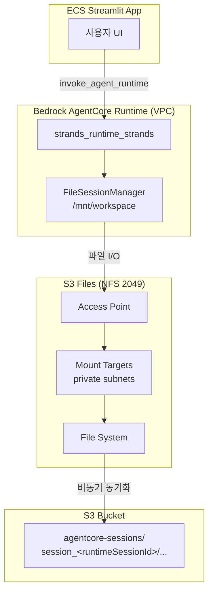

# Amazon S3 Files — strands-runtime 적용 가이드

이 문서는 **Amazon S3 Files**가 무엇인지, **strands-runtime**에서 왜·어떻게 쓰는지, boto3로 생성하는 방법, 필요한 IAM 권한, 런타임 동작을 정리합니다.

관련 코드:

- 인프라 생성: [installer.py](./installer.py) — `create_s3_files_session_storage()`
- Runtime 연결: [runtime_agent/strands/installer.py](./runtime_agent/strands/installer.py)
- 세션 저장: [runtime_agent/strands/strands_agent.py](./runtime_agent/strands/strands_agent.py)
- 삭제: [uninstaller.py](./uninstaller.py) — `delete_s3_files_session_storage()`

---

## S3 Files란?

**Amazon S3 Files**는 기존 **Amazon S3 버킷**을 **NFS(Network File System)** 로 마운트해, 애플리케이션이 **일반 파일 I/O**(`open`, `write`, `mkdir`)로 읽고 쓸 수 있게 해 주는 관리형 파일시스템입니다.

| 관점 | 설명 |
|------|------|
| 백엔드 | 고객이 소유한 S3 버킷 (지정 prefix 아래 객체) |
| 클라이언트 인터페이스 | NFSv4.2 over TLS (포트 **2049**) |
| 동기화 | NFS에서 쓴 내용이 S3 객체로 **비동기 동기화** (보통 수십 초 지연) |
| 인증 | IAM 기반 (`s3files:ClientMount`, `ClientWrite` 등) |

S3 API로 `put_object`를 호출하는 것과 달리, 컨테이너 안에서는 **로컬 디렉터리**처럼 동작합니다. AgentCore Runtime은 이 경로를 `filesystemConfigurations`로 마운트합니다.

---

## 왜 써야 하나?

strands-runtime은 AgentCore Runtime에서 **대화 이력·agent state**를 `/mnt/workspace`에 영속화합니다. 저장 방식은 두 가지입니다.

| 방식 | API | Network | Version 업데이트 후 세션 | S3 버킷 동기화 |
|------|-----|---------|--------------------------|----------------|
| Managed `sessionStorage` | `sessionStorage` | `PUBLIC` | **초기화될 수 있음** | 없음 (AWS 관리) |
| **S3 Files** (기본) | `s3FilesAccessPoint` | **VPC** | **유지** | 고객 S3 버킷 `agentcore-sessions/` |

strands-runtime이 S3 Files를 기본으로 쓰는 이유:

1. **배포 후에도 세션 유지** — `update_agent_runtime`으로 이미지를 갱신해도 checkpoint·메시지가 S3에 남습니다.
2. **고객 버킷에서 확인 가능** — 콘솔/S3 API로 `agentcore-sessions/` prefix 아래 세션 파일을 조회할 수 있습니다.
3. **Strands `FileSessionManager`와 자연스럽게 연동** — 코드 변경 없이 `storage_dir="/mnt/workspace"`만 사용합니다.
4. **세션 격리** — `runtimeSessionId`별로 `session_<id>/` 디렉터리가 생성됩니다.

`application/config.json`에 `s3_files_access_point_arn`이 없으면 installer는 managed `sessionStorage` + `PUBLIC` 모드로 fallback합니다.

---

## strands-runtime에서의 아키텍처



**실제 배포 예시** (`strands-runtime` 설치 후):

| 항목 | 예시 값 |
|------|---------|
| S3 버킷 | `storage-for-strands-runtime-262976740991-us-west-2` |
| File system | `fs-08e050d07b0997405` |
| Access point ARN | `arn:aws:s3files:us-west-2:262976740991:file-system/fs-08e050d07b0997405/access-point/fsap-0688173c4e15ed755` |
| Session prefix | `agentcore-sessions/` |
| Runtime mount path | `/mnt/workspace` |
| Runtime network | `VPC` (private subnets + `agent-runtime-sg-for-strands-runtime`) |

S3 콘솔에서 세션 파일 경로 예:

```text
s3://storage-for-strands-runtime-262976740991-us-west-2/
  agentcore-sessions/
    session_ef48be61-6c9c-5de0-9a7a-ddd1063fe03f/
      session.json
      agents/agent_default/
        agent.json
        messages/message_0.json
        messages/message_1.json
```

컨테이너 내부 경로:

```text
/mnt/workspace/
  session_<runtimeSessionId>/
    session.json
    agents/agent_<id>/...
```

---

## 생성 흐름 (installer.py)

루트 [installer.py](./installer.py)의 `[5.5/10] Creating S3 Files session storage` 단계에서 **멱등**으로 다음을 생성합니다.

1. **Sync IAM role** — `role-s3files-sync-for-{project_name}` (S3 ↔ NFS 동기화)
2. **S3 bucket versioning** — `Enabled` (필수)
3. **File system** — bucket + prefix `agentcore-sessions/`
4. **Security groups** — runtime SG ↔ mount target SG (TCP 2049)
5. **Mount targets** — private subnet별
6. **Access point** — POSIX `uid/gid: 0/0`
7. **File system policy** — Runtime 실행 역할에 NFS mount/write 허용
8. **VPC endpoint SG 보강** — Bedrock 접근용

결과는 `application/config.json`에 기록됩니다.

```json
{
  "s3_files_file_system_id": "fs-08e050d07b0997405",
  "s3_files_access_point_arn": "arn:aws:s3files:us-west-2:...:access-point/fsap-...",
  "agent_runtime_vpc_subnets": ["subnet-...", "subnet-..."],
  "agent_runtime_security_groups": ["sg-..."]
}
```

---

## boto3로 생성하기 (단계별 예제)

아래는 installer 로직을 축약한 **수동 프로비저닝** 예제입니다. 프로덕션에서는 `python3 installer.py` 사용을 권장합니다.

### 사전 조건

```python
import json
import time
import boto3

region = "us-west-2"
project_name = "strands-runtime"
bucket_name = f"storage-for-{project_name}-{account_id}-{region}"
s3_bucket_arn = f"arn:aws:s3:::{bucket_name}"
session_prefix = "agentcore-sessions/"

s3 = boto3.client("s3", region_name=region)
iam = boto3.client("iam", region_name=region)
s3files = boto3.client("s3files", region_name=region)
ec2 = boto3.client("ec2", region_name=region)
```

### 1. S3 버킷 versioning 활성화

```python
s3.put_bucket_versioning(
    Bucket=bucket_name,
    VersioningConfiguration={"Status": "Enabled"},
)
```

### 2. S3 Files sync role 생성

S3 Files 서비스가 버킷과 동기화할 때 assume하는 역할입니다.

```python
sync_role_name = f"role-s3files-sync-for-{project_name}"
trust_policy = {
    "Version": "2012-10-17",
    "Statement": [{
        "Effect": "Allow",
        "Principal": {"Service": "elasticfilesystem.amazonaws.com"},
        "Action": "sts:AssumeRole",
        "Condition": {
            "StringEquals": {"aws:SourceAccount": account_id},
            "ArnLike": {
                "aws:SourceArn": f"arn:aws:s3files:{region}:{account_id}:file-system/*"
            },
        },
    }],
}

role = iam.create_role(
    RoleName=sync_role_name,
    AssumeRolePolicyDocument=json.dumps(trust_policy),
)
sync_role_arn = role["Role"]["Arn"]

# S3 버킷 read/write + EventBridge sync (installer와 동일)
iam.put_role_policy(
    RoleName=sync_role_name,
    PolicyName="s3-bucket-access",
    PolicyDocument=json.dumps({
        "Version": "2012-10-17",
        "Statement": [{
            "Effect": "Allow",
            "Action": [
                "s3:ListBucket", "s3:GetObject", "s3:PutObject", "s3:DeleteObject",
                "s3:ListBucketVersions", "s3:GetObjectVersion", "s3:DeleteObjectVersion",
                # ... (전체 목록은 installer.py _get_or_create_s3files_sync_role 참조)
            ],
            "Resource": [s3_bucket_arn, f"{s3_bucket_arn}/*"],
        }],
    }),
)
```

### 3. File system 생성

```python
fs = s3files.create_file_system(
    bucket=s3_bucket_arn,
    prefix=session_prefix,
    roleArn=sync_role_arn,
    acceptBucketWarning=True,
    tags=[{"key": "Name", "value": f"s3files-for-{project_name}"}],
)
file_system_id = fs["fileSystemId"]
print(file_system_id)  # 예: fs-08e050d07b0997405
```

### 4. Mount target 생성 (VPC private subnet)

```python
vpc_id = "vpc-0fce4b0b170cf9d76"          # installer가 만든 VPC
private_subnet_id = "subnet-0128479aa77b1a3d8"
mount_sg_id = "sg-..."                       # NFS 2049 허용 SG

mt = s3files.create_mount_target(
    fileSystemId=file_system_id,
    subnetId=private_subnet_id,
    securityGroups=[mount_sg_id],
)
```

Security group 규칙 (installer 기준):

- **Mount target SG**: ingress TCP 2049 from **agent runtime SG**
- **Agent runtime SG**: egress TCP 2049 to **mount target SG**

### 5. Access point 생성

```python
ap = s3files.create_access_point(
    fileSystemId=file_system_id,
    posixUser={"uid": 0, "gid": 0},
    rootDirectory={
        "path": "/",
        "creationPermissions": {
            "ownerUid": 0,
            "ownerGid": 0,
            "permissions": "0777",
        },
    },
)
access_point_arn = ap["accessPointArn"]
```

### 6. File system policy (resource-based)

Runtime **실행 역할 IAM만으로는 NFS 쓰기가 허용되지 않을 수 있습니다.** file system에 client policy를 반드시 설정합니다.

```python
agent_runtime_role_arn = (
    f"arn:aws:iam::{account_id}:role/AmazonBedrockAgentCoreRuntimeRoleFor{project_name}"
)

s3files.put_file_system_policy(
    fileSystemId=file_system_id,
    policy=json.dumps({
        "Version": "2012-10-17",
        "Statement": [{
            "Effect": "Allow",
            "Principal": {"AWS": agent_runtime_role_arn},
            "Action": ["s3files:ClientMount", "s3files:ClientWrite"],
            "Condition": {
                "StringEquals": {
                    "s3files:AccessPointArn": access_point_arn,
                }
            },
        }],
    }),
)
```

### 7. AgentCore Runtime에 마운트 연결

```python
agentcore = boto3.client("bedrock-agentcore-control", region_name=region)

agentcore.update_agent_runtime(
    agentRuntimeId="strands_runtime_strands-g0DXc3HYdS",
    description="S3 Files session storage",
    agentRuntimeArtifact={
        "containerConfiguration": {
            "containerUri": (
                f"{account_id}.dkr.ecr.{region}.amazonaws.com/"
                f"strands-runtime_strands:20260628184833"
            ),
        },
    },
    filesystemConfigurations=[{
        "s3FilesAccessPoint": {
            "accessPointArn": access_point_arn,
            "mountPath": "/mnt/workspace",
        },
    }],
    networkConfiguration={
        "networkMode": "VPC",
        "networkModeConfig": {
            "subnets": ["subnet-0128479aa77b1a3d8", "subnet-03c5e658744e2daaf"],
            "securityGroups": ["sg-09c078dc6f80ab592"],
        },
    },
    roleArn=agent_runtime_role_arn,
    protocolConfiguration={"serverProtocol": "HTTP"},
)
```

`mountPath`는 반드시 `/mnt/` 하위 1단계 경로여야 합니다 (예: `/mnt/workspace`).

---

## 필요한 IAM 권한

S3 Files 연동에는 **세 종류**의 권한이 필요합니다.

### 1. Installer 실행 주체 (사용자/CI 역할)

S3 Files 리소스 CRUD, VPC/SG, IAM role 생성:

- `s3files:*` (또는 `CreateFileSystem`, `CreateAccessPoint`, `CreateMountTarget`, `PutFileSystemPolicy` 등)
- `ec2:*` (VPC, subnet, security group)
- `iam:*` (sync role, runtime role)
- `s3:PutBucketVersioning`

### 2. S3 Files sync role (`role-s3files-sync-for-{project_name}`)

| 정책 | 용도 |
|------|------|
| Trust | `elasticfilesystem.amazonaws.com` (S3 Files 서비스) |
| `s3-bucket-access` | 버킷·객체 read/write (동기화) |
| `eventbridge-sync` | `DO-NOT-DELETE-S3-Files*` 규칙 관리 |

### 3. AgentCore Runtime 실행 역할 (`AmazonBedrockAgentCoreRuntimeRoleFor{project_name}`)

**Identity-based policy** (`runtime_agent/strands/installer.py` — `create_bedrock_agentcore_policy`):

```python
file_system_arn = f"arn:aws:s3files:{region}:{account_id}:file-system/{file_system_id}"

# Statement 1: NFS mount/write
{
    "Sid": "S3FilesClientAccess",
    "Effect": "Allow",
    "Action": ["s3files:ClientMount", "s3files:ClientWrite"],
    "Resource": file_system_arn,
    "Condition": {
        "ArnEquals": {"s3files:AccessPointArn": access_point_arn}
    },
}
# Statement 2: Runtime 생성/갱신 시 access point 검증
{
    "Sid": "S3FilesGetAccessPoint",
    "Effect": "Allow",
    "Action": ["s3files:GetAccessPoint"],
    "Resource": access_point_arn,  # file system ARN이 아님!
}
# Statement 3: mount target 검증
{
    "Sid": "S3FilesListMountTargets",
    "Effect": "Allow",
    "Action": ["s3files:ListMountTargets"],
    "Resource": file_system_arn,
}
```

> **주의:** `s3files:GetAccessPoint`의 `Resource`를 file system ARN으로만 지정하면 `update_agent_runtime` 시 `ValidationException: Ensure the role has s3files:GetAccessPoint`가 발생합니다. **access point ARN**을 별도 statement로 지정해야 합니다.

**Resource-based policy** (file system policy):

```python
{
    "Effect": "Allow",
    "Principal": {"AWS": agent_runtime_role_arn},
    "Action": ["s3files:ClientMount", "s3files:ClientWrite"],
    "Condition": {
        "StringEquals": {"s3files:AccessPointArn": access_point_arn}
    },
}
```

두 정책(identity + resource)이 **모두** 있어야 Runtime이 `/mnt/workspace`에 쓸 수 있습니다.

---

## 런타임 동작

### 1. Cold start — NFS 마운트

AgentCore Runtime이 VPC 모드로 기동되면:

1. `filesystemConfigurations.s3FilesAccessPoint`에 따라 access point를 NFS로 마운트
2. 마운트 경로 `/mnt/workspace`가 컨테이너에 노출
3. microVM 내부에서는 root(uid 0)로 파일 I/O 수행

### 2. 세션 저장 — FileSessionManager

[strands_agent.py](./runtime_agent/strands/strands_agent.py):

```python
session_manager = FileSessionManager(
    session_id=get_runtime_session_id(),  # BedrockAgentCoreContext.get_session_id()
    storage_dir="/mnt/workspace",
)

agent = Agent(
    model=model,
    tools=tools,
    conversation_manager=conversation_manager,
    session_manager=session_manager,
)
```

사용자가 CloudFront UI에서 메시지를 내면:

1. ECS 앱이 `invoke_agent_runtime(runtimeSessionId=...)` 호출
2. Runtime이 `FileSessionManager`로 `/mnt/workspace/session_<id>/`에 JSON 파일 기록
3. S3 Files가 NFS 변경을 버킷 `agentcore-sessions/` 아래로 **비동기 동기화** (~60초 지연 가능)

### 3. 세션 복원

동일한 `runtimeSessionId`로 다시 invoke하면 `FileSessionManager`가 기존 `session_<id>/` 디렉터리를 읽어 대화 이력을 복원합니다.

### 4. Managed sessionStorage와의 차이

| 시나리오 | Managed `sessionStorage` | S3 Files |
|----------|--------------------------|----------|
| stop/resume (같은 Version) | 유지 | 유지 |
| `update_agent_runtime` 후 | **초기화** | **유지** |
| 14일 미호출 | 초기화 | 고객 관리 |
| S3 콘솔에서 확인 | 불가 | `agentcore-sessions/` prefix |

---

## 네트워크 요구사항

S3 Files는 **VPC 전용**입니다.

| 항목 | 요구사항 |
|------|----------|
| Runtime `networkMode` | `VPC` |
| Subnets | S3 Files mount target과 **동일 AZ**의 private subnet |
| Security group | Runtime SG → Mount SG **TCP 2049** egress/ingress |
| Bedrock VPC endpoint | Runtime SG가 endpoint SG에 포함 (installer가 자동 추가) |

위 조건이 맞지 않으면 invoke 시 **HTTP 424 (Failed Dependency)** 또는 mount 실패가 발생할 수 있습니다.

---

## 트러블슈팅

| 증상 | 원인 | 해결 |
|------|------|------|
| S3 bucket에 세션 파일 없음 | Runtime이 `PUBLIC` + `sessionStorage` 모드 | `python3 runtime_agent/strands/installer.py`로 S3 Files + VPC 재배포 |
| `Ensure the role has s3files:GetAccessPoint` | IAM `GetAccessPoint` Resource가 file system ARN | access point ARN으로 분리 (위 IAM 섹션 참조) |
| `Permission denied: /mnt/workspace/session_...` | file system policy 미설정 | `_ensure_s3files_file_system_policy()` 실행 또는 installer 재실행 |
| 버킷 루트만 보이고 `agentcore-sessions/` 없음 | 동기화 지연 또는 Runtime 미마운트 | 1~2분 대기, Runtime `filesystemConfigurations` 확인 |
| HTTP 424 | SG(2049) 또는 AZ 불일치 | mount target·runtime subnet·SG 규칙 점검 |

CloudWatch 로그 그룹: `/aws/bedrock-agentcore/runtimes/strands_runtime_strands-<id>-DEFAULT`

---

## 삭제

[uninstaller.py](./uninstaller.py)는 다음 순서로 S3 Files를 정리합니다.

1. AgentCore Runtime 삭제
2. Access point 삭제
3. Mount target 삭제
4. File system 삭제 (`forceDelete=True`)
5. Sync role 삭제
6. S3 bucket 삭제
7. `application/config.json`, `runtime_agent/strands/config.json` 삭제

```bash
cd strands-runtime
python3 uninstaller.py --yes
```

File system이 남아 있으면 S3 bucket 삭제가 실패할 수 있으므로, **반드시 S3 Files를 bucket보다 먼저** 삭제합니다.

---

## 요약

| 질문 | 답 |
|------|-----|
| S3 Files란? | S3 버킷을 NFS로 마운트하는 관리형 파일시스템 |
| 왜 쓰나? | AgentCore 세션을 배포·Version 갱신 후에도 유지하고, 고객 S3에서 확인하려고 |
| strands-runtime에서 어디에? | `/mnt/workspace` → S3 `agentcore-sessions/` |
| 어떻게 만드나? | `python3 installer.py` (또는 위 boto3 단계) |
| 핵심 권한? | sync role(S3+EventBridge), runtime role(3개 S3 Files statement), file system policy |
| 앱 코드 변경? | 없음 — `FileSessionManager(storage_dir="/mnt/workspace")` 그대로 사용 |

더 자세한 배포 절차는 [README.md — Session Storage](./README.md#session-storage)를 참조하세요.
